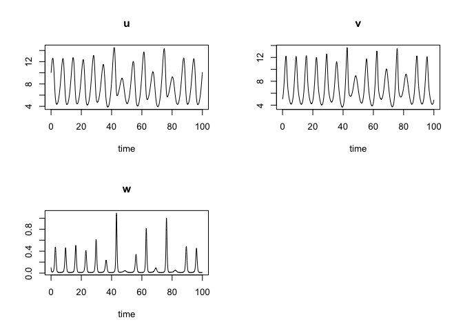
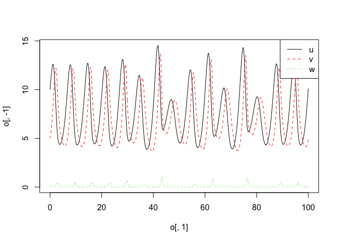

simecol
================


### todo:
- develop 'solver' insight; make-or-break the modelling exercise
- the time step can also be crucial
- what is a 'gridModel' anyway?
- model stress testing from the command line

## read this: http://desolve.r-forge.r-project.org/slides/tutorial.pdf


## references out there:
- https://unamatematicaseltigre.blogspot.com/2016/09/population-growth-models-using-rsimecol.html
- https://assemblingnetwork.wordpress.com/2013/01/31/two-species-predator-prey-systems-with-r/


## cloning one of the simecol documented examples....


``` r
# https://cran.r-project.org/web/packages/simecol/vignettes/b-simecol-howtos.pdf
library("simecol")
```

    ## Loading required package: deSolve

``` r
f <- function(x, y, k){x*y / (1+k*x)} # Holling II

upca <- new("odeModel", 
         main = function(time, y, parms) {
          with(as.list(c(parms, y)), {
            du <- a * u - alpha1 * f(u, v, k1)
            dv <- -b * v + alpha1 * f(u, v, k1) +
                      - alpha2 * f(v, w, k2)
            dw <- -c * (w - wstar) + alpha2 * f(v, w, k2)
            list(c(du, dv, dw))
           })
         },
        times = seq(0, 100, 0.1),
        parms = c(a=1, b=1, c=10, alpha1=0.2, alpha2=1,
        k1=0.05, k2=0, wstar=0.006),
        init = c(u=10, v=5, w=0.1),
        solver = "lsoda"
      )
```

``` r
upca <- sim(upca)
plot(upca)
```



``` r
# extract the results from upca with a so called accessor function out, and to use arbitrary, user-defined plot functions

plotupca <- function(obj, ...) {
  o <- out(obj)
  matplot(o[,1], o[,-1], type="l", ...)
  legend("topright", legend = c("u", "v", "w"), lty=1:3, , bg="white",col = 1:3)
}
```

``` r
 plotupca(upca)
```



``` r
head(out(upca))
```

    ##   time        u        v          w
    ## 1  0.0 10.00000 5.000000 0.10000000
    ## 2  0.1 10.33392 5.135125 0.06578790
    ## 3  0.2 10.66555 5.303297 0.04555125
    ## 4  0.3 10.98970 5.500955 0.03357124
    ## 5  0.4 11.30105 5.726463 0.02651518
    ## 6  0.5 11.59396 5.979221 0.02243125

``` r
main(upca)
```

    ## function(time, y, parms) {
    ##           with(as.list(c(parms, y)), {
    ##             du <- a * u - alpha1 * f(u, v, k1)
    ##             dv <- -b * v + alpha1 * f(u, v, k1) +
    ##                       - alpha2 * f(v, w, k2)
    ##             dw <- -c * (w - wstar) + alpha2 * f(v, w, k2)
    ##             list(c(du, dv, dw))
    ##            })
    ##          }

``` r
init(upca)
```

    ##    u    v    w 
    ## 10.0  5.0  0.1

``` r
parms(upca)
```

    ##      a      b      c alpha1 alpha2     k1     k2  wstar 
    ##  1e+00  1e+00  1e+01  2e-01  1e+00  5e-02  0e+00  6e-03

``` r
equations(upca)
```

    ## NULL

``` r
solver(upca)
```

    ## [1] "lsoda"

``` r
class(upca)
```

    ## [1] "odeModel"
    ## attr(,"package")
    ## [1] "simecol"

``` r
str(upca)
```

    ## Formal class 'odeModel' [package "simecol"] with 10 slots
    ##   ..@ parms    : Named num [1:8] 1e+00 1e+00 1e+01 2e-01 1e+00 5e-02 0e+00 6e-03
    ##   .. ..- attr(*, "names")= chr [1:8] "a" "b" "c" "alpha1" ...
    ##   ..@ init     : Named num [1:3] 10 5 0.1
    ##   .. ..- attr(*, "names")= chr [1:3] "u" "v" "w"
    ##   ..@ observer : NULL
    ##   ..@ main     :function (time, y, parms)  
    ##   .. ..- attr(*, "srcref")=Class 'srcref'  atomic [1:8] 6 17 14 10 17 10 6 14
    ##   .. .. .. ..- attr(*, "srcfile")=Classes 'srcfilecopy', 'srcfile' <environment: 0x7f8c3c64f2d0> 
    ##   ..@ equations: NULL
    ##   ..@ times    : num [1:1001] 0 0.1 0.2 0.3 0.4 0.5 0.6 0.7 0.8 0.9 ...
    ##   ..@ inputs   : NULL
    ##   ..@ solver   : chr "lsoda"
    ##   ..@ out      : deSolve [1:1001, 1:4] 0 0.1 0.2 0.3 0.4 0.5 0.6 0.7 0.8 0.9 ...
    ##   .. ..- attr(*, "dimnames")=List of 2
    ##   .. .. ..$ : NULL
    ##   .. .. ..$ : chr [1:4] "time" "u" "v" "w"
    ##   .. ..- attr(*, "istate")= int [1:21] 2 1316 2723 NA 5 5 0 68 23 NA ...
    ##   .. ..- attr(*, "rstate")= num [1:5] 0.1 0.1 100.1 0 0
    ##   .. ..- attr(*, "lengthvar")= int 3
    ##   .. ..- attr(*, "class")= chr [1:2] "deSolve" "matrix"
    ##   .. ..- attr(*, "type")= chr "lsoda"
    ##   ..@ initfunc : NULL


### License
[GNU General Public License](https://www.gnu.org/licenses/gpl.html)

Data and Content distributed under the License is distributed on an "AS IS" BASIS, WITHOUT WARRANTIES OR CONDITIONS OF ANY KIND, either express or implied. See the License for the specific language governing permissions and limitations under the License.
