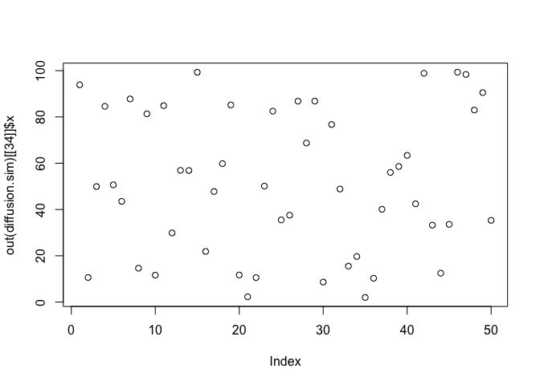
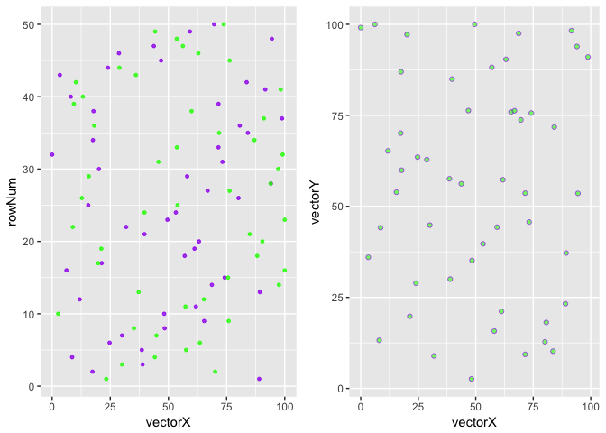
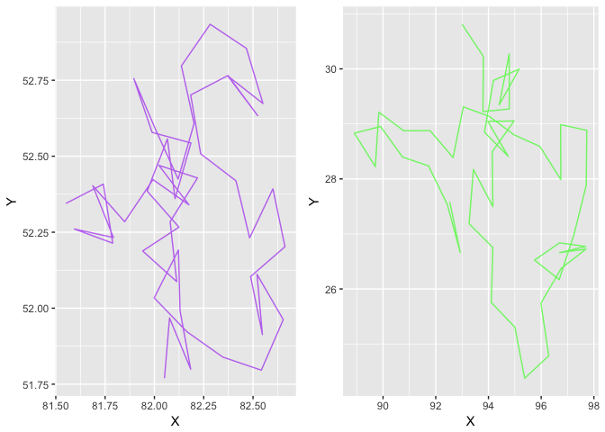

simecol XY molecular diffusion
================

``` r
library("simecol")
```

    ## Loading required package: deSolve

``` r
# https://cran.r-project.org/web/packages/simecol/simecol.pdf
diffusion.model <- rwalkModel(
  main = function(time, init, parms, inputs = NULL) {
    speed <- parms$speed
    xleft <- parms$area[1]
    xright <- parms$area[2]
    ybottom <- parms$area[3]
    ytop <- parms$area[4]
    x <- init$x # x coordinate
    y <- init$y # y coordinate
    a <- init$a # angle (in radians)
    n <- length(a)
    ## Rule 1: respect environment (grid as given in "inputs")
    ## 1a) identify location on "environmental 2D grid" for each individual
    i.j <- array(c(pmax(1, ceiling(x)), pmax(1, ceiling(y))), dim=c(n, 2))
    ## 1b) speed dependend on "environmental conditions"
    speed <- speed * inputs[i.j]
    ## Rule 2: Random Walk
    a <- (a + 2 * pi / runif(a))
    dx <- speed * cos(a)
    dy <- speed * sin(a)
    x <- x + dx
    y <- y + dy
    ## Rule 3: Wrap Around
    x <- ifelse(x > xright, xleft, x)
    y <- ifelse(y > ytop, ybottom, y)
    x <- ifelse(x < xleft, xright, x)
    y <- ifelse(y < ybottom, ytop, y)
    data.frame(x=x, y=y, a=a)
  },
  times = c(from=0, to=100, by=1),
  parms = list(ninds=50, speed = 1, area = c(0, 100, 0, 100)),
  solver = "iteration",
  initfunc = function(obj) {
    ninds <- obj@parms$ninds
    xleft <- obj@parms$area[1]
    xright <- obj@parms$area[2]
    ybottom <- obj@parms$area[3]
    ytop <- obj@parms$area[4]
    obj@init <- data.frame(x = runif(ninds) * (xright - xleft) + xleft,
                          y = runif(ninds) * (ytop - ybottom) + ybottom,
                          a = runif(ninds) * 2 * pi)
    inp <- matrix(1, nrow=100, ncol=100)
    inp[, 45:55] <- 0.2
    inputs(obj) <- inp
    obj
  }
)
```

``` r
diffusion.sim <- sim(diffusion.model)

out(diffusion.sim)[[34]]$x
```

    ##  [1] 93.887670 10.614102 49.914438 84.602027 50.668672 43.520630 87.788387
    ##  [8] 14.634977 81.345105 11.628150 84.876890 29.873780 56.909006 56.852900
    ## [15] 99.298494 21.884205 47.773810 59.824620 85.189612 11.697517  2.288108
    ## [22] 10.557604 50.122237 82.507512 35.515871 37.549386 86.823027 68.719596
    ## [29] 86.843920  8.651570 76.718315 48.862886 15.548280 19.699804  1.999067
    ## [36] 10.284221 40.095458 56.028157 58.592138 63.385752 42.450926 98.852328
    ## [43] 33.239701 12.485594 33.581065 99.352732 98.360780 82.978939 90.517080
    ## [50] 35.300606

``` r
plot(out(diffusion.sim)[[34]]$x)
```



``` r
plotupca <- function(obj, type) {
  
  library(gridExtra)
  library(ggplot2)
  
  if (type=="S4") {
    o.df <- out(obj)  # output a dataframe
  } else {
    o.df <- obj
  }
  
  head(o.df)
  
  gg1 <- ggplot()  +
    geom_point(aes(y=rowNum, x=vectorX), o.df, colour = "purple", size=1, alpha=0.8)  +
    geom_point(aes(y=rowNum, x=vectorY), o.df, colour = "green", size=1, alpha=0.8)
  
  gg2 <- ggplot()  +
    geom_point(aes(x=vectorX, y=vectorY), o.df, fill="green", shape=21, colour = "purple", alpha=0.6) 
  
  
  grid.arrange(gg1, gg2, ncol=2, nrow=1)

}
```

``` r
# plotupca(out(diffusion.sim)[[34]]$x)

vectorX <- out(diffusion.sim)[[34]]$x
vectorY <- out(diffusion.sim)[[34]]$y

points.df <- as.data.frame(vectorX)
points.df$vectorY <- vectorY
points.df$rowNum <- seq.int(nrow(points.df))

head(points.df)
```

    ##    vectorX  vectorY rowNum
    ## 1 93.88767 64.02074      1
    ## 2 10.61410 54.78129      2
    ## 3 49.91444 39.57435      3
    ## 4 84.60203 60.08201      4
    ## 5 50.66867 37.61715      5
    ## 6 43.52063 49.71639      6

``` r
plotupca(points.df, type="S3")
```



``` r
# plotupca(out(diffusion.sim)[[34]]$x)

# graph the path of a particle

# walk through the 50 moves (or "observations") 
# getting the x,y coords for each particle
move.list <- list()
for (j in 1:50) {
    vectorX <- out(diffusion.sim)[[j]]$x # get all x from observation j
    vectorY <- out(diffusion.sim)[[j]]$y
    path.df <- as.data.frame(vectorX)
    path.df$vectorY <- vectorY
    move.list[[j]] <- path.df
    rm("path.df")
}
# move.list is a list of dataframes that individually represent the x,y path
# of each particle (row1 represnts particle1)
# walk through the 50 particles in each move to collect its path

# plot the path of particle #21 and #41
df <- as.data.frame(move.list[21])
gg1 <- ggplot()  +
    geom_path(aes(x=vectorX, y=vectorY), df, fill="green", shape=21, colour = "purple", alpha=0.6) 
```

    ## Warning: Ignoring unknown parameters: fill, shape

``` r
df <- as.data.frame(move.list[41])
gg2 <- ggplot()  +
    geom_path(aes(x=vectorX, y=vectorY), df, fill="red", shape=21, colour = "green", alpha=0.6)
```

    ## Warning: Ignoring unknown parameters: fill, shape

``` r
grid.arrange(gg1, gg2, ncol=2, nrow=1)
```



``` r
head(out(diffusion.sim)[22])
```

    ## [[1]]
    ##             x         y         a
    ## 1  92.8115279 67.150185  443.5656
    ## 2  10.8653389 54.946450 1358.6927
    ## 3  51.4662467 41.413291  428.2955
    ## 4  84.0789899 64.120766  483.9750
    ## 5  52.7074696 36.738631 2311.4928
    ## 6  43.5467842 49.032087  906.1624
    ## 7  89.5410501 30.587882  934.9430
    ## 8  18.4311573 88.240979  982.5159
    ## 9  84.6153810 11.142358  488.3203
    ## 10 14.4464597  1.073512  507.9831
    ## 11 84.6753262 53.480507  303.0330
    ## 12 27.3513386 36.507664  776.6470
    ## 13 58.3494165 30.191982 3250.6291
    ## 14 55.9536309 71.762441  822.3425
    ## 15 97.3601460 60.368580  509.9457
    ## 16 24.5201514 88.279189  432.0262
    ## 17 50.1247597 71.808527  796.7831
    ## 18 60.6128069 45.070463  409.9196
    ## 19 89.2309123 80.133455  616.7629
    ## 20  9.0869936 24.954402 1798.3477
    ## 21  3.5835587 68.563317  743.6242
    ## 22  9.1197251 37.226506  616.7164
    ## 23 50.4390215 16.398470 5045.8276
    ## 24 81.3194881 33.996256  302.9749
    ## 25 38.8653830  6.679220  363.0609
    ## 26 33.9852919 92.608813  667.7487
    ## 27 85.4216799 30.167609  773.2242
    ## 28 65.0577457 14.634646  975.7745
    ## 29 86.6061390 45.455655  612.3818
    ## 30  9.5323980 32.072055  873.9226
    ## 31 79.5251395 85.021567  480.6738
    ## 32 46.7721454 11.273779  647.4037
    ## 33 15.1072186 51.265708  513.6387
    ## 34 22.4909776  1.192019 2080.8587
    ## 35  1.7855618 52.356964  969.9898
    ## 36  7.8744096 93.088286  676.4735
    ## 37 39.3555113 54.162307 1225.1265
    ## 38 58.8689360 70.690836  540.6730
    ## 39 58.7794138 35.341709  573.0985
    ## 40 67.0305046 87.659060  626.3762
    ## 41 42.0801378 35.413061  260.0677
    ## 42 98.3625503 50.457942  747.9065
    ## 43 30.1725710  7.646515  315.7331
    ## 44 13.0943691 50.384515 1547.3761
    ## 45 38.7771292 80.270913  775.7924
    ## 46 97.2460822 25.279540 2009.8684
    ## 47  0.7734725 27.697393  292.1057
    ## 48 84.4014991 92.151263  349.8702
    ## 49 87.0593396 38.960564  947.2335
    ## 50 34.3313016 77.143566  884.1913

``` r
main(diffusion.sim)
```

    ## function(time, init, parms, inputs = NULL) {
    ##     speed <- parms$speed
    ##     xleft <- parms$area[1]
    ##     xright <- parms$area[2]
    ##     ybottom <- parms$area[3]
    ##     ytop <- parms$area[4]
    ##     x <- init$x # x coordinate
    ##     y <- init$y # y coordinate
    ##     a <- init$a # angle (in radians)
    ##     n <- length(a)
    ##     ## Rule 1: respect environment (grid as given in "inputs")
    ##     ## 1a) identify location on "environmental 2D grid" for each individual
    ##     i.j <- array(c(pmax(1, ceiling(x)), pmax(1, ceiling(y))), dim=c(n, 2))
    ##     ## 1b) speed dependend on "environmental conditions"
    ##     speed <- speed * inputs[i.j]
    ##     ## Rule 2: Random Walk
    ##     a <- (a + 2 * pi / runif(a))
    ##     dx <- speed * cos(a)
    ##     dy <- speed * sin(a)
    ##     x <- x + dx
    ##     y <- y + dy
    ##     ## Rule 3: Wrap Around
    ##     x <- ifelse(x > xright, xleft, x)
    ##     y <- ifelse(y > ytop, ybottom, y)
    ##     x <- ifelse(x < xleft, xright, x)
    ##     y <- ifelse(y < ybottom, ytop, y)
    ##     data.frame(x=x, y=y, a=a)
    ##   }

``` r
init(diffusion.sim)
```

    ##             x          y          a
    ## 1  96.6837892 72.3802459 3.42343636
    ## 2   8.0607088 58.6081386 3.61389941
    ## 3  51.4454911 42.4669673 1.98337057
    ## 4  85.8473902 60.3399507 3.40249668
    ## 5  54.2878587 34.2254267 1.18909050
    ## 6  43.4677323 48.6499865 1.53173188
    ## 7  91.3518906 30.8777934 4.32273235
    ## 8  20.1077155 85.9322719 5.62629917
    ## 9  83.1347034 11.4259902 2.78340979
    ## 10 13.2921479 97.5707667 4.05222458
    ## 11 86.2560858 56.0162768 5.96411096
    ## 12 28.0797262 36.0701595 2.90264475
    ## 13 63.9330334 28.7136694 1.95902276
    ## 14 57.1656263 68.9779693 4.02652874
    ## 15 97.4100678 63.4191709 3.25590990
    ## 16 25.2565741 89.4130633 6.00782689
    ## 17 45.3616297 70.3927562 5.42168772
    ## 18 59.7052652 43.6289638 4.58029143
    ## 19 89.8344817 78.4480865 3.01281572
    ## 20  7.7234968 20.6089883 2.71072126
    ## 21  0.8148355 69.5625964 5.14215171
    ## 22  7.8262640 39.5963667 2.15026455
    ## 23 47.4086439 13.6123480 1.03712498
    ## 24 84.1557111 41.6433571 0.67551695
    ## 25 38.0682928  4.5200558 5.90220287
    ## 26 31.1922881 92.0602235 2.07649466
    ## 27 83.5987012 28.1767989 3.59010329
    ## 28 67.2457008 11.2168313 0.05093947
    ## 29 87.8136175 44.2619345 4.67171984
    ## 30  4.7075144 30.0093229 3.22124266
    ## 31 80.6597821 83.7301815 0.16150145
    ## 32 48.5166611 10.5151411 4.64089246
    ## 33 15.7315961 51.7840460 1.14368047
    ## 34 21.8465430  3.4258324 0.89511095
    ## 35  1.9777421 52.6787221 3.33087280
    ## 36  6.0588924  0.7798484 2.02162670
    ## 37 38.2010697 54.0751056 1.23432186
    ## 38 59.1872156 74.1653385 5.80982025
    ## 39 59.3730047 35.6564952 6.23393914
    ## 40 77.5786434 87.7060983 4.63226625
    ## 41 40.9541444 37.7530210 0.81056113
    ## 42 98.1780624 50.6777092 0.16801869
    ## 43 25.1719357 11.9921925 0.34476896
    ## 44 12.6200227 50.2760211 2.27338717
    ## 45 39.7723149 76.3182758 5.06928632
    ## 46 95.8416580 25.3483289 2.84385828
    ## 47  8.5199464 21.2011308 5.71083699
    ## 48 84.7852051 88.1158848 4.17727152
    ## 49 91.3550290 41.4858111 2.85136307
    ## 50 38.2517001 77.5674562 1.68274123

``` r
parms(diffusion.sim)
```

    ## $ninds
    ## [1] 50
    ## 
    ## $speed
    ## [1] 1
    ## 
    ## $area
    ## [1]   0 100   0 100

``` r
equations(diffusion.sim)
```

    ## NULL

``` r
solver(diffusion.sim)
```

    ## [1] "iteration"

``` r
class(diffusion.sim)
```

    ## [1] "rwalkModel"
    ## attr(,"package")
    ## [1] "simecol"

``` r
#str(diffusion.sim)
```
