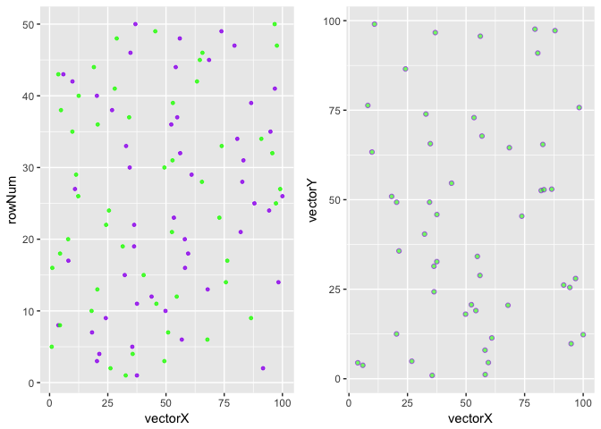

simecol XY molecular diffusion (random walk)
================

``` r
library("simecol")
```

    ## Loading required package: deSolve

``` r
# https://cran.r-project.org/web/packages/simecol/simecol.pdf
diffusion.model <- rwalkModel(
  main = function(time, init, parms, inputs = NULL) {
    speed <- parms$speed
    xleft <- parms$area[1]
    xright <- parms$area[2]
    ybottom <- parms$area[3]
    ytop <- parms$area[4]
    x <- init$x # x coordinate
    y <- init$y # y coordinate
    a <- init$a # angle (in radians)
    n <- length(a)
    ## Rule 1: respect environment (grid as given in "inputs")
    ## 1a) identify location on "environmental 2D grid" for each individual
    i.j <- array(c(pmax(1, ceiling(x)), pmax(1, ceiling(y))), dim=c(n, 2))
    ## 1b) speed dependend on "environmental conditions"
    speed <- speed * inputs[i.j]
    ## Rule 2: Random Walk
    a <- (a + 2 * pi / runif(a))
    dx <- speed * cos(a)
    dy <- speed * sin(a)
    x <- x + dx
    y <- y + dy
    ## Rule 3: Wrap Around
    x <- ifelse(x > xright, xleft, x)
    y <- ifelse(y > ytop, ybottom, y)
    x <- ifelse(x < xleft, xright, x)
    y <- ifelse(y < ybottom, ytop, y)
    data.frame(x=x, y=y, a=a)
  },
  times = c(from=0, to=100, by=1),
  parms = list(ninds=50, speed = 1, area = c(0, 100, 0, 100)),
  solver = "iteration",
  initfunc = function(obj) {
    ninds <- obj@parms$ninds
    xleft <- obj@parms$area[1]
    xright <- obj@parms$area[2]
    ybottom <- obj@parms$area[3]
    ytop <- obj@parms$area[4]
    obj@init <- data.frame(x = runif(ninds) * (xright - xleft) + xleft,
                          y = runif(ninds) * (ytop - ybottom) + ybottom,
                          a = runif(ninds) * 2 * pi)
    inp <- matrix(1, nrow=100, ncol=100)
    inp[, 45:55] <- 0.2
    inputs(obj) <- inp
    obj
  }
)
```

``` r
diffusion.sim <- sim(diffusion.model)

out(diffusion.sim)[[34]]$x
```

    ##  [1] 10.885741 83.669403 18.296181 73.294348 70.254538 39.084972 71.612993
    ##  [8] 92.359621 62.731695 11.097747 21.794119 91.197294 12.543727 38.609391
    ## [15]  3.379766 53.214167 77.734893 10.958748  7.319485 67.367878 57.653159
    ## [22] 22.434465 97.511995 12.560244 41.980000 71.533695 83.913634 86.232083
    ## [29] 40.712220 72.364760 12.469860  1.752888 99.692449 87.625889 97.472081
    ## [36] 11.545896 17.837459 62.613281 24.962542  3.078355 94.400277 68.085612
    ## [43] 57.393664 91.967703 66.916186 14.335474 76.902257 61.111829 12.549573
    ## [50]  0.679925

``` r
plot(out(diffusion.sim)[[34]]$x)
```


``` r
plotupca <- function(obj, type) {
  
  library(gridExtra)
  library(ggplot2)
  
  if (type=="S4") {
    o.df <- out(obj)  # output a dataframe
  } else {
    o.df <- obj
  }
  
  head(o.df)
  
  gg1 <- ggplot()  +
    geom_point(aes(y=rowNum, x=vectorX), o.df, colour = "purple", size=1, alpha=0.8)  +
    geom_point(aes(y=rowNum, x=vectorY), o.df, colour = "green", size=1, alpha=0.8)
  
  gg2 <- ggplot()  +
    geom_point(aes(x=vectorX, y=vectorY), o.df, fill="green", shape=21, colour = "purple", alpha=0.6) 
  
  
  grid.arrange(gg1, gg2, ncol=2, nrow=1)

}
```

``` r
# plotupca(out(diffusion.sim)[[34]]$x)

vectorX <- out(diffusion.sim)[[34]]$x
vectorY <- out(diffusion.sim)[[34]]$y

points.df <- as.data.frame(vectorX)
points.df$vectorY <- vectorY
points.df$rowNum <- seq.int(nrow(points.df))

head(points.df)
```

    ##    vectorX  vectorY rowNum
    ## 1 10.88574 34.17376      1
    ## 2 83.66940 86.78902      2
    ## 3 18.29618 27.53370      3
    ## 4 73.29435 79.99880      4
    ## 5 70.25454 56.44146      5
    ## 6 39.08497 93.04567      6

``` r
plotupca(points.df, type="S3")
```



``` r
# plotupca(out(diffusion.sim)[[34]]$x)

# graph the path of a particle

# walk through the 50 moves (or "observations") 
# getting the x,y coords for each particle
move.list <- list()
for (j in 1:50) {
    vectorX <- out(diffusion.sim)[[j]]$x # get all x from observation j
    vectorY <- out(diffusion.sim)[[j]]$y
    path.df <- as.data.frame(vectorX)
    path.df$vectorY <- vectorY
    move.list[[j]] <- path.df
    rm("path.df")
}
# move.list is a list of dataframes that individually represent the x,y path
# of each particle (row1 represnts particle1)
# walk through the 50 particles in each move to collect its path

# plot the path of particle #21 and #41
df <- as.data.frame(move.list[21])
gg1 <- ggplot()  +
    geom_path(aes(x=vectorX, y=vectorY), df, fill="green", shape=21, colour = "purple", alpha=0.6) 
```

    ## Warning: Ignoring unknown parameters: fill, shape

``` r
df <- as.data.frame(move.list[41])
gg2 <- ggplot()  +
    geom_path(aes(x=vectorX, y=vectorY), df, fill="red", shape=21, colour = "green", alpha=0.6)
```

    ## Warning: Ignoring unknown parameters: fill, shape

``` r
grid.arrange(gg1, gg2, ncol=2, nrow=1)
```


``` r
head(out(diffusion.sim)[22])
```

    ## [[1]]
    ##            x          y           a
    ## 1   9.904286  38.152910   4460.2538
    ## 2  86.039838  88.638207    491.6006
    ## 3  16.473467  25.438553    733.4626
    ## 4  72.584688  80.103823    421.8601
    ## 5  73.305582  61.221653    339.5749
    ## 6  41.672000  92.159517    500.4822
    ## 7  69.381940  13.957178    651.5095
    ## 8  92.131543  62.872739    349.2734
    ## 9  63.055112  32.533073    666.4903
    ## 10 10.778524  50.269702    376.7374
    ## 11 23.113349  43.966530    457.0753
    ## 12 91.691349  48.523113    779.0287
    ## 13 11.100714  35.694200   1472.8588
    ## 14 37.166909  96.313340   4199.8139
    ## 15  2.858997  47.976334   2336.8010
    ## 16 47.630362   5.069546    350.7921
    ## 17 83.341325  86.686554    956.8694
    ## 18 10.215150  51.982006    627.0972
    ## 19  4.905208  63.385000    575.6021
    ## 20 69.470302  12.362827   1255.2904
    ## 21 58.727591  73.699242    499.7505
    ## 22 22.922085  30.492111    320.8537
    ## 23 97.422809  92.293818 677998.4484
    ## 24 13.317590  41.227923    606.2760
    ## 25 43.491548  21.727839    431.8421
    ## 26 69.921589  10.091484    461.2886
    ## 27 83.732071  47.325711    622.8063
    ## 28 87.923358  83.450409    706.8117
    ## 29 40.891840  44.530141   2576.3925
    ## 30 71.054676  50.707806    720.1488
    ## 31 11.371174  83.543102   2581.9899
    ## 32  1.980028  51.852527    623.3055
    ## 33 99.216681  31.758016    699.7441
    ## 34 89.045267   1.513541   1417.7442
    ## 35 96.473925  50.069068    974.3295
    ## 36 11.783992   2.206031    382.2608
    ## 37 19.812798  92.780180   1552.3858
    ## 38 61.950298  93.520303    668.3841
    ## 39 25.255545  54.635157    371.6589
    ## 40  3.786678  63.569945    518.8582
    ## 41 93.263712  44.818077    323.1941
    ## 42 68.324898  44.913098   1653.7419
    ## 43 55.359178  18.740780    369.8915
    ## 44 91.807412  53.484279   1984.6272
    ## 45 66.741517  20.732597    293.5253
    ## 46 15.691627   8.811674    711.4888
    ## 47 74.885948   8.505724    708.6987
    ## 48 61.295577 100.000000    363.4866
    ## 49 12.575562   8.959802    355.5578
    ## 50 99.805539  23.526666   1300.6031

``` r
main(diffusion.sim)
```

    ## function(time, init, parms, inputs = NULL) {
    ##     speed <- parms$speed
    ##     xleft <- parms$area[1]
    ##     xright <- parms$area[2]
    ##     ybottom <- parms$area[3]
    ##     ytop <- parms$area[4]
    ##     x <- init$x # x coordinate
    ##     y <- init$y # y coordinate
    ##     a <- init$a # angle (in radians)
    ##     n <- length(a)
    ##     ## Rule 1: respect environment (grid as given in "inputs")
    ##     ## 1a) identify location on "environmental 2D grid" for each individual
    ##     i.j <- array(c(pmax(1, ceiling(x)), pmax(1, ceiling(y))), dim=c(n, 2))
    ##     ## 1b) speed dependend on "environmental conditions"
    ##     speed <- speed * inputs[i.j]
    ##     ## Rule 2: Random Walk
    ##     a <- (a + 2 * pi / runif(a))
    ##     dx <- speed * cos(a)
    ##     dy <- speed * sin(a)
    ##     x <- x + dx
    ##     y <- y + dy
    ##     ## Rule 3: Wrap Around
    ##     x <- ifelse(x > xright, xleft, x)
    ##     y <- ifelse(y > ytop, ybottom, y)
    ##     x <- ifelse(x < xleft, xright, x)
    ##     y <- ifelse(y < ybottom, ytop, y)
    ##     data.frame(x=x, y=y, a=a)
    ##   }

``` r
init(diffusion.sim)
```

    ##              x         y          a
    ## 1  11.51367584 42.343733 3.80553934
    ## 2  80.41044753 82.087925 0.50471829
    ## 3  19.52366978 25.800379 2.44874195
    ## 4  70.92901058 83.219835 5.15400322
    ## 5  74.38716008 60.071659 2.25078039
    ## 6  45.42285865 93.222312 3.95235351
    ## 7  69.29529742 15.106208 0.56040624
    ## 8  97.35064150 65.854928 5.33685412
    ## 9  63.72259946 33.004535 5.47427265
    ## 10 11.74330940 50.291628 1.75540812
    ## 11 26.45134991 38.704685 0.09382701
    ## 12 90.77757765 48.568390 6.21585088
    ## 13 16.94570868 29.518710 5.98024536
    ## 14 37.11152007 91.364190 4.55094561
    ## 15  3.14037064 48.633881 3.68534549
    ## 16 46.78738061  7.763693 0.82107303
    ## 17 86.48695978 85.624436 4.67180773
    ## 18 10.90985956 51.381586 3.03460412
    ## 19  0.05020567 61.425194 3.62198057
    ## 20 69.69837253  7.639765 0.73166187
    ## 21 63.80575302 73.970218 2.15707872
    ## 22 21.23060238 28.433255 2.63912772
    ## 23 95.40393329 95.420043 4.59189654
    ## 24 10.93568329 41.478924 3.95428737
    ## 25 47.04444632 25.576408 4.43245930
    ## 26 68.32919887  5.680803 0.25736731
    ## 27 83.05855840 47.088853 0.03295166
    ## 28 87.84439249 87.045895 5.26988756
    ## 29 43.11840474 41.792970 2.48784507
    ## 30 70.45226609 51.389379 3.09274640
    ## 31 14.25960257 86.957212 6.16065118
    ## 32  2.78800349 51.848876 2.17096616
    ## 33 95.76363196 31.557081 5.57663273
    ## 34 86.90573603  1.981344 5.12534603
    ## 35 96.19896994 50.177821 0.82277352
    ## 36  9.51719952  5.820337 4.67467120
    ## 37 19.75034627 93.394527 2.27971349
    ## 38 64.10772353  1.434153 2.61972686
    ## 39 25.44009876 56.381874 3.60083913
    ## 40 10.08476634 65.203320 6.12234621
    ## 41 93.54828261 43.853994 2.48665680
    ## 42 68.03725860 44.704534 4.14509183
    ## 43 51.11922307 20.307156 4.34974669
    ## 44 93.12838861 53.602419 1.83340407
    ## 45 71.32325284 22.832901 5.87316925
    ## 46 14.36203083 14.341441 0.65693216
    ## 47 76.58859410  2.804629 2.68748868
    ## 48 63.74177441 98.557079 0.74001496
    ## 49 17.56891161  7.370317 2.49826884
    ## 50 95.22198534 23.331724 4.32955004

``` r
parms(diffusion.sim)
```

    ## $ninds
    ## [1] 50
    ## 
    ## $speed
    ## [1] 1
    ## 
    ## $area
    ## [1]   0 100   0 100

``` r
equations(diffusion.sim)
```

    ## NULL

``` r
solver(diffusion.sim)
```

    ## [1] "iteration"

``` r
class(diffusion.sim)
```

    ## [1] "rwalkModel"
    ## attr(,"package")
    ## [1] "simecol"

``` r
#str(diffusion.sim)
```
