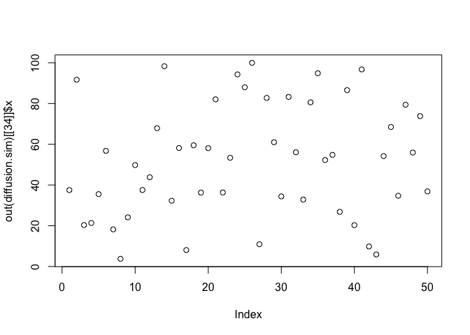
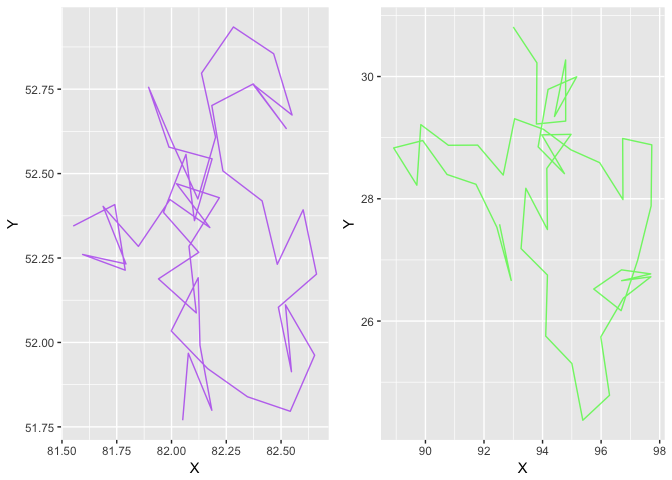

simecol XY molecular diffusion (random walk)
================

``` r
library("simecol")
```

    ## Loading required package: deSolve

``` r
# https://cran.r-project.org/web/packages/simecol/simecol.pdf
diffusion.model <- rwalkModel(
  main = function(time, init, parms, inputs = NULL) {
    speed <- parms$speed
    xleft <- parms$area[1]
    xright <- parms$area[2]
    ybottom <- parms$area[3]
    ytop <- parms$area[4]
    x <- init$x # x coordinate
    y <- init$y # y coordinate
    a <- init$a # angle (in radians)
    n <- length(a)
    ## Rule 1: respect environment (grid as given in "inputs")
    ## 1a) identify location on "environmental 2D grid" for each individual
    i.j <- array(c(pmax(1, ceiling(x)), pmax(1, ceiling(y))), dim=c(n, 2))
    ## 1b) speed dependend on "environmental conditions"
    speed <- speed * inputs[i.j]
    ## Rule 2: Random Walk
    a <- (a + 2 * pi / runif(a))
    dx <- speed * cos(a)
    dy <- speed * sin(a)
    x <- x + dx
    y <- y + dy
    ## Rule 3: Wrap Around
    x <- ifelse(x > xright, xleft, x)
    y <- ifelse(y > ytop, ybottom, y)
    x <- ifelse(x < xleft, xright, x)
    y <- ifelse(y < ybottom, ytop, y)
    data.frame(x=x, y=y, a=a)
  },
  times = c(from=0, to=100, by=1),
  parms = list(ninds=50, speed = 1, area = c(0, 100, 0, 100)),
  solver = "iteration",
  initfunc = function(obj) {
    ninds <- obj@parms$ninds
    xleft <- obj@parms$area[1]
    xright <- obj@parms$area[2]
    ybottom <- obj@parms$area[3]
    ytop <- obj@parms$area[4]
    obj@init <- data.frame(x = runif(ninds) * (xright - xleft) + xleft,
                          y = runif(ninds) * (ytop - ybottom) + ybottom,
                          a = runif(ninds) * 2 * pi)
    inp <- matrix(1, nrow=100, ncol=100)
    inp[, 45:55] <- 0.2
    inputs(obj) <- inp
    obj
  }
)
```

``` r
diffusion.sim <- sim(diffusion.model)

out(diffusion.sim)[[34]]$x
```

    ##  [1]  37.514731  91.674947  20.352538  21.365265  35.525464  56.785173
    ##  [7]  18.233670   3.773654  24.147327  49.788856  37.543430  43.805600
    ## [13]  67.900273  98.296018  32.284004  58.165191   8.070503  59.504818
    ## [19]  36.291400  58.080456  82.065963  36.327764  53.388152  94.289814
    ## [25]  87.967269 100.000000  10.907439  82.767153  60.990992  34.417388
    ## [31]  83.250411  56.080316  32.861396  80.604802  94.855339  52.268301
    ## [37]  54.815461  26.835911  86.569099  20.311076  96.745987   9.830593
    ## [43]   5.911791  54.183446  68.487647  34.731889  79.413210  55.929979
    ## [49]  73.808291  36.862584

``` r
plot(out(diffusion.sim)[[34]]$x)
```



``` r
plotupca <- function(obj, type) {
  
  library(gridExtra)
  library(ggplot2)
  
  if (type=="S4") {
    o.df <- out(obj)  # output a dataframe
  } else {
    o.df <- obj
  }
  
  head(o.df)
  
  gg1 <- ggplot()  +
    geom_point(aes(y=rowNum, x=vectorX), o.df, colour = "purple", size=1, alpha=0.8)  +
    geom_point(aes(y=rowNum, x=vectorY), o.df, colour = "green", size=1, alpha=0.8)
  
  gg2 <- ggplot()  +
    geom_point(aes(x=vectorX, y=vectorY), o.df, fill="green", shape=21, colour = "purple", alpha=0.6) 
  
  
  grid.arrange(gg1, gg2, ncol=2, nrow=1)

}
```

``` r
# plotupca(out(diffusion.sim)[[34]]$x)

vectorX <- out(diffusion.sim)[[34]]$x
vectorY <- out(diffusion.sim)[[34]]$y

points.df <- as.data.frame(vectorX)
points.df$vectorY <- vectorY
points.df$rowNum <- seq.int(nrow(points.df))

head(points.df)
```

    ##    vectorX    vectorY rowNum
    ## 1 37.51473 32.7006556      1
    ## 2 91.67495 26.1605689      2
    ## 3 20.35254 49.2942693      3
    ## 4 21.36527 35.6860443      4
    ## 5 35.52546  0.9184849      5
    ## 6 56.78517 67.7750709      6

``` r
plotupca(points.df, type="S3")
```


``` r
# plotupca(out(diffusion.sim)[[34]]$x)

# graph the path of a particle

# walk through the 50 moves (or "observations") 
# getting the x,y coords for each particle
move.list <- list()
for (j in 1:50) {
    vectorX <- out(diffusion.sim)[[j]]$x # get all x from observation j
    vectorY <- out(diffusion.sim)[[j]]$y
    path.df <- as.data.frame(vectorX)
    path.df$vectorY <- vectorY
    move.list[[j]] <- path.df
    rm("path.df")
}
# move.list is a list of dataframes that individually, seen as a pair of vectors,
# represent the x,y position of each particle for that observation

# now, walk across observations, selecting specific particle paths
particleZ.list <- vector(mode = "list", length = 50)

for (j in 1:50) { # for each particle
  particleZ.X <- vector("numeric", 0)
  particleZ.Y <- vector("numeric", 0)
  for (z in 1:50) { # for each observation
    particleZ.X <- c(particleZ.X, move.list[[z]]$vectorX[j])
    particleZ.Y <- c(particleZ.Y, move.list[[z]]$vectorY[j])
  }
  particleZ.list[[j]] <- data.frame(cbind(particleZ.X, particleZ.Y))
  colnames(particleZ.list[[j]]) <- c("X", "Y")
}

# of each particle (row1/df1 represents particle1) 
# CAUTION: wrap-around is not identified

# plot the path of particle #21 and #41
df <- particleZ.list[[21]]
gg1 <- ggplot()  +
    geom_path(aes(x=X, y=Y), df, colour = "purple", alpha=0.6) 
df <- df <- particleZ.list[[41]]
gg2 <- ggplot()  +
    geom_path(aes(x=X, y=Y), df, colour = "green", alpha=0.6)

grid.arrange(gg1, gg2, ncol=2, nrow=1)
```



``` r
head(out(diffusion.sim)[22])
```

    ## [[1]]
    ##              x         y          a
    ## 1  37.99042234 30.146655  1771.5840
    ## 2  92.90757132 23.347958   499.5680
    ## 3  20.63821446 49.574283   334.1909
    ## 4  20.86623978 35.505225   563.1338
    ## 5  35.27293462  1.596915   434.6891
    ## 6  54.12651023 64.693807   857.4688
    ## 7  18.19757602 50.537267  1336.4471
    ## 8   3.05989196  7.500066   834.6423
    ## 9  21.59499026 84.803784   337.6245
    ## 10 48.18570293 18.768800 32655.6414
    ## 11 37.94458230 45.133061   629.1363
    ## 12 44.00856942 53.796907  2806.7792
    ## 13 67.85076955 18.107571   656.6241
    ## 14 98.95945956 76.266878  2562.5280
    ## 15 33.67710734 40.339437   512.9739
    ## 16 60.33396320 97.059093  3051.1712
    ## 17  9.67863472 75.419883   864.9096
    ## 18 58.80399733  4.126759   585.9672
    ## 19 36.28101653 28.624183  1810.3281
    ## 20 58.11919278  4.847727   324.1058
    ## 21 82.37209907 52.764138   467.3862
    ## 22 38.04005116 22.795348   307.0631
    ## 23 53.86172844 74.106863   715.8495
    ## 24 94.38652858 26.903029   568.6186
    ## 25 81.90960566 94.512605   424.5614
    ## 26  0.01641759 13.260746   519.9500
    ## 27 12.24276961  0.000000   528.0804
    ## 28 87.84864946 60.576251  2155.1636
    ## 29 62.41995068  5.751406   510.7347
    ## 30 34.73341437 49.367169   579.6297
    ## 31 82.77103732 53.008514  1247.0614
    ## 32 51.12378024 95.132408   316.8271
    ## 33 34.89987758 76.838681   917.0214
    ## 34 79.10369300 92.045275   657.4120
    ## 35 97.32021568 11.666656  2848.1568
    ## 36 48.77554497 21.558988  3588.4477
    ## 37 54.25763468 33.344078   421.7578
    ## 38 30.64804435  5.244597   376.8882
    ## 39 86.67482026 52.622208   660.0392
    ## 40 20.46375828 14.574680   454.8827
    ## 41 95.98950778 25.740470  1214.5279
    ## 42  9.31529777 64.860531   422.7965
    ## 43  5.83140426  3.590325   504.4502
    ## 44 57.47278687 14.229601   285.2386
    ## 45 65.02740491 65.391213  2968.8778
    ## 46 34.12761974 62.402266   526.1273
    ## 47 78.01916649 98.282903  1348.4985
    ## 48 55.19257091 31.781732   624.1988
    ## 49 73.33588944 44.988607   913.6847
    ## 50 34.86793280 95.512164   556.9531

``` r
main(diffusion.sim)
```

    ## function(time, init, parms, inputs = NULL) {
    ##     speed <- parms$speed
    ##     xleft <- parms$area[1]
    ##     xright <- parms$area[2]
    ##     ybottom <- parms$area[3]
    ##     ytop <- parms$area[4]
    ##     x <- init$x # x coordinate
    ##     y <- init$y # y coordinate
    ##     a <- init$a # angle (in radians)
    ##     n <- length(a)
    ##     ## Rule 1: respect environment (grid as given in "inputs")
    ##     ## 1a) identify location on "environmental 2D grid" for each individual
    ##     i.j <- array(c(pmax(1, ceiling(x)), pmax(1, ceiling(y))), dim=c(n, 2))
    ##     ## 1b) speed dependend on "environmental conditions"
    ##     speed <- speed * inputs[i.j]
    ##     ## Rule 2: Random Walk
    ##     a <- (a + 2 * pi / runif(a))
    ##     dx <- speed * cos(a)
    ##     dy <- speed * sin(a)
    ##     x <- x + dx
    ##     y <- y + dy
    ##     ## Rule 3: Wrap Around
    ##     x <- ifelse(x > xright, xleft, x)
    ##     y <- ifelse(y > ytop, ybottom, y)
    ##     x <- ifelse(x < xleft, xright, x)
    ##     y <- ifelse(y < ybottom, ytop, y)
    ##     data.frame(x=x, y=y, a=a)
    ##   }

``` r
init(diffusion.sim)
```

    ##            x          y          a
    ## 1  37.835976 30.2597194 5.58060051
    ## 2  93.656231 22.5939799 0.05737346
    ## 3  21.123410 50.2145149 5.16723726
    ## 4  20.646348 41.4139976 5.27279040
    ## 5  35.518973  0.6834224 1.38073163
    ## 6  56.915035 68.4244317 1.51672844
    ## 7  18.142609 50.2763136 0.01722741
    ## 8   9.170637  4.6883681 5.00196233
    ## 9  20.984725 90.6780310 1.04438960
    ## 10 48.810044 26.2756623 3.89831839
    ## 11 36.945852 45.9601039 4.63612132
    ## 12 43.805850 54.6059101 5.05493670
    ## 13 66.627933 13.7096650 1.84904562
    ## 14 98.766424 73.9312072 1.54555894
    ## 15 36.684102 39.3263339 5.27665515
    ## 16 61.496490  0.1411695 3.81807574
    ## 17  9.000723 81.1888906 4.92742943
    ## 18 58.432854  6.9576170 3.18265864
    ## 19 32.969479 24.2333975 2.99624179
    ## 20 61.898367  7.4687686 3.97295422
    ## 21 82.051093 51.7696280 3.14143389
    ## 22 42.466201 24.1836808 1.59887558
    ## 23 52.809556 76.5509423 4.00228636
    ## 24  7.174292 26.7114085 5.09044079
    ## 25 79.931465 94.3763996 2.40113983
    ## 26  3.924428  9.0325987 3.16719934
    ## 27  3.299172  0.9965433 2.79302533
    ## 28 83.839593 58.8241469 5.11922796
    ## 29 60.859693  6.3310262 2.57338050
    ## 30 34.037436 48.7260355 4.13212936
    ## 31 81.896801 53.9544153 0.93074410
    ## 32 53.380890 96.3686506 4.66633081
    ## 33 38.803922 82.4845325 3.73092207
    ## 34 80.798447 95.1400255 0.11948809
    ## 35  1.450805  8.4094982 5.37718090
    ## 36 42.196662 23.0107446 3.65408781
    ## 37 47.033899 37.2816692 0.30655717
    ## 38 31.659093  3.6849020 5.77704604
    ## 39 86.123994 53.1989347 5.88825454
    ## 40 24.526776 12.5748208 5.97516679
    ## 41 92.998674 30.8106147 1.59249029
    ## 42 14.590309 58.6488288 5.07622919
    ## 43  9.016525  5.9010946 3.97289785
    ## 44 59.820936 10.6233620 5.28054384
    ## 45 64.575431 64.8240538 3.57702302
    ## 46 30.151994 60.6297385 6.00085163
    ## 47 75.947238  1.5302637 0.19172572
    ## 48 55.008083 35.2969031 0.49087505
    ## 49 72.978860 45.3664473 5.15595130
    ## 50 27.012808 97.1720603 3.44016623

``` r
parms(diffusion.sim)
```

    ## $ninds
    ## [1] 50
    ## 
    ## $speed
    ## [1] 1
    ## 
    ## $area
    ## [1]   0 100   0 100

``` r
equations(diffusion.sim)
```

    ## NULL

``` r
solver(diffusion.sim)
```

    ## [1] "iteration"

``` r
class(diffusion.sim)
```

    ## [1] "rwalkModel"
    ## attr(,"package")
    ## [1] "simecol"

``` r
#str(diffusion.sim)
```
