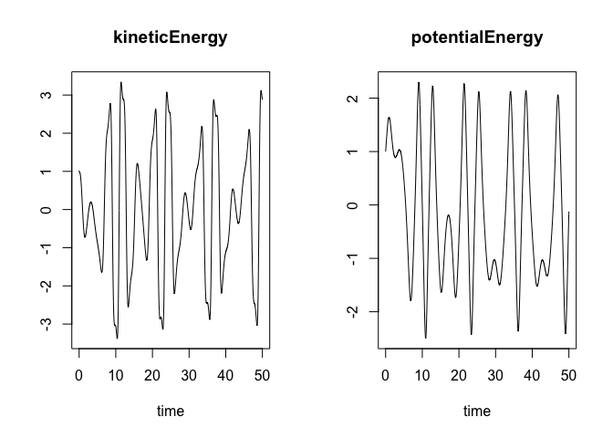
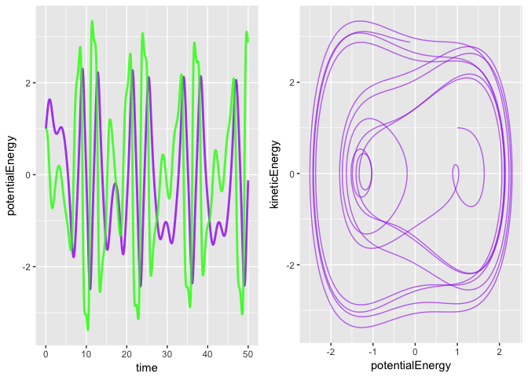

simecol bistable plus excitation
================

``` r
library("simecol")
```

    ## Loading required package: deSolve

``` r
bis.model <- new("odeModel",                   # object class = 'odeModel'
                
         main = function(times, y, parms) {   # object method
                                              # simecol magic: 2nd argument 'y' points to 'init'
          with(as.list(c(parms, y)), {
            
            PEdt <- potentialEnergy - '^'(potentialEnergy,3)  - friction*kineticEnergy +
 sin(times)
            KEdt <- kineticEnergy
            
            potentialEnergy <- KEdt
            kineticEnergy <- PEdt
            
            list(c(kineticEnergy, potentialEnergy))    # object attributes (data) 
            
           })
         },
        times = seq(0, 50, .015625),
        parms = c(factor=1, friction=.01),
        init = c(kineticEnergy=1, potentialEnergy=1),
        solver = "lsoda"                      # 'lsoda' available for 'odemodel' class
        
      )
```

``` r
bis.sim <- sim(bis.model)
plot(bis.sim)
```



``` r
plotupca <- function(obj, ...) {
  
  library(gridExtra)
  library(ggplot2)
  
  o.df <- out(obj)  # output a dataframe
  
  gg1 <- ggplot()  +
    geom_line(aes(x=time, y=potentialEnergy), o.df, colour = "purple", size=1, alpha=0.8)  +
    geom_line(aes(x=time, y=kineticEnergy), o.df, colour = "green", size=1, alpha=0.8)
  
  gg2 <- ggplot()  +
    geom_path(aes(x=potentialEnergy, y=kineticEnergy), o.df,  colour = "purple", alpha=0.6) 
  
  
  grid.arrange(gg1, gg2, ncol=2, nrow=1)

}
```

``` r
 plotupca(bis.sim)
```



``` r
head(out(bis.sim))
```

    ##       time kineticEnergy potentialEnergy
    ## 1 0.000000     1.0000000        1.000000
    ## 2 0.015625     0.9997169        1.015623
    ## 3 0.031250     0.9991667        1.031239
    ## 4 0.046875     0.9983278        1.046845
    ## 5 0.062500     0.9971750        1.062436
    ## 6 0.078125     0.9956849        1.078005

``` r
main(bis.sim)
```

    ## function(times, y, parms) {   # object method
    ##                                               # simecol magic: 2nd argument 'y' points to 'init'
    ##           with(as.list(c(parms, y)), {
    ##             
    ##             PEdt <- potentialEnergy - '^'(potentialEnergy,3)  - friction*kineticEnergy +
    ##  sin(times)
    ##             KEdt <- kineticEnergy
    ##             
    ##             potentialEnergy <- KEdt
    ##             kineticEnergy <- PEdt
    ##             
    ##             list(c(kineticEnergy, potentialEnergy))    # object attributes (data) 
    ##             
    ##            })
    ##          }

``` r
init(bis.sim)
```

    ##   kineticEnergy potentialEnergy 
    ##               1               1

``` r
parms(bis.sim)
```

    ##   factor friction 
    ##     1.00     0.01

``` r
equations(bis.sim)
```

    ## NULL

``` r
solver(bis.sim)
```

    ## [1] "lsoda"

``` r
class(bis.sim)
```

    ## [1] "odeModel"
    ## attr(,"package")
    ## [1] "simecol"

``` r
str(bis.sim)
```

    ## Formal class 'odeModel' [package "simecol"] with 10 slots
    ##   ..@ parms    : Named num [1:2] 1 0.01
    ##   .. ..- attr(*, "names")= chr [1:2] "factor" "friction"
    ##   ..@ init     : Named num [1:2] 1 1
    ##   .. ..- attr(*, "names")= chr [1:2] "kineticEnergy" "potentialEnergy"
    ##   ..@ observer : NULL
    ##   ..@ main     :function (times, y, parms)  
    ##   .. ..- attr(*, "srcref")=Class 'srcref'  atomic [1:8] 6 17 20 10 17 10 6 20
    ##   .. .. .. ..- attr(*, "srcfile")=Classes 'srcfilecopy', 'srcfile' <environment: 0x7f82f1d585c8> 
    ##   ..@ equations: NULL
    ##   ..@ times    : num [1:3201] 0 0.0156 0.0312 0.0469 0.0625 ...
    ##   ..@ inputs   : NULL
    ##   ..@ solver   : chr "lsoda"
    ##   ..@ out      : deSolve [1:3201, 1:3] 0 0.0156 0.0312 0.0469 0.0625 ...
    ##   .. ..- attr(*, "dimnames")=List of 2
    ##   .. .. ..$ : NULL
    ##   .. .. ..$ : chr [1:3] "time" "kineticEnergy" "potentialEnergy"
    ##   .. ..- attr(*, "istate")= int [1:21] 2 3205 6330 NA 7 7 0 52 22 NA ...
    ##   .. ..- attr(*, "rstate")= num [1:5] 0.0156 0.0156 50.0145 0 0
    ##   .. ..- attr(*, "lengthvar")= int 2
    ##   .. ..- attr(*, "class")= chr [1:2] "deSolve" "matrix"
    ##   .. ..- attr(*, "type")= chr "lsoda"
    ##   ..@ initfunc : NULL
