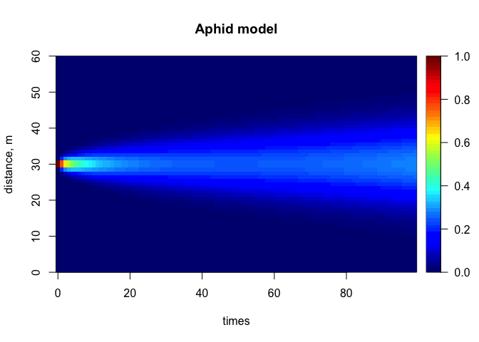

aphids
================

``` r
## install.packages("ReacTran")
##
## https://www.rdocumentation.org/packages/deSolve/versions/1.20/topics/plot.deSolve
#

## =======================================================================
## The Aphid model from Soetaert and Herman, 2009.
## A practical guide to ecological modelling.
## Using R as a simulation platform. Springer.
## =======================================================================

## 1-D diffusion model

## ================
## Model equations
## ================
Aphid <- function(t, APHIDS, parameters) {
  deltax  <- c (0.5, rep(1, numboxes - 1), 0.5)
  Flux    <- -D * diff(c(0, APHIDS, 0))/deltax
  dAPHIDS <- -diff(Flux)/delx + APHIDS * r
  list(dAPHIDS, Flux = Flux)
}

## ==================
## Model application
## ==================

require(deSolve)
```

    ## Loading required package: deSolve

``` r
## the model parameters:
D         <- 0.3    # m2/day  diffusion rate
r         <- 0.01   # /day    net growth rate
delx      <- 1      # m       thickness of boxes
numboxes  <- 60

## distance of boxes on plant, m, 1 m intervals
Distance  <- seq(from = 0.5, by = delx, length.out = numboxes)

## Initial conditions, ind/m2
## aphids present only on two central boxes
APHIDS        <- rep(0, times = numboxes)
APHIDS[30:31] <- 1
state         <- c(APHIDS = APHIDS)      # initialise state variables

## RUNNING the model:
times <- seq(0, 200, by = 1)   # output wanted at these time intervals
out   <- ode.1D(state, times, Aphid, parms = 0, nspec = 1, names = "Aphid")

image(out, grid = Distance, main = "Aphid model", ylab = "distance, m",
  legend = TRUE)
```


``` r
## restricting time
image(out, grid = Distance, main = "Aphid model", ylab = "distance, m",
  legend = TRUE, subset = time < 100)
```



``` r
image(out, grid = Distance, main = "Aphid model", ylab = "distance, m",
  method = "persp", border = NA, theta = 30)
```


``` r
FluxAphid <- subset(out, select = "Flux", subset = time < 50)

matplot.1D(out, type = "l", lwd = 2, xyswap = TRUE, lty = 1)
```


``` r
matplot.1D(out, type = "l", lwd = 2, xyswap = TRUE, lty = 1,
           subset = time < 50)
```


``` r
matplot.1D(out, type = "l", lwd = 2, xyswap = TRUE, lty = 1,
           subset = time %in% seq(0, 200, by = 10), col = "grey")
```


