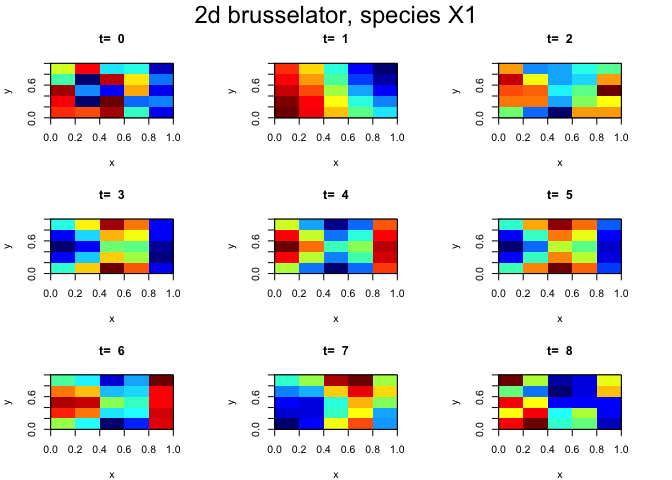
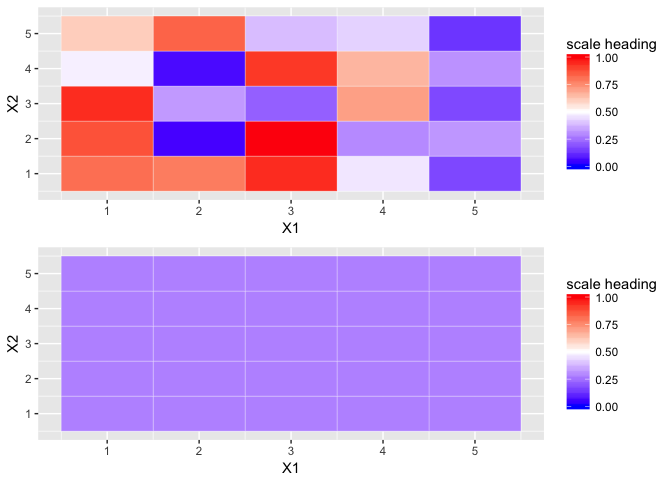

2-D Brusselator: disecting the ode.2D() result matrix - at the bottom, compare the ggplot() row 1 heatmap to the image() t0 heatmap
================

``` r
ggBuild <- function(ggRow, data, DimX, DimY) {
  
  # return ggplot() graphs to compare an ode.2D() matrix to those 
  # generated by image()
  #
  # currently, ggBuild() is expecting a 5x5 test matrix
  
  if (DimX != DimY) {
    stop('ggBuild() stop: expecting a square matrix')
  }
  
  # TODO: use DimX and DimY to avoid hardcoded column
  # definitions ( e.g.: data[ggRow,17:21] ) used to create ggData.matriix
  
# > summary(out)
#                   X1           X2
# Min.        0.001202 1.402000e-04
# 1st Qu.     0.289200 1.382000e+00
# Median      0.383800 2.769000e+00
# Mean        0.773400 2.697000e+00
# 3rd Qu.     0.703400 4.011000e+00
# Max.        3.701000 4.719000e+00
# N       22500.000000 2.250000e+04  22,500 values for x and y
# sd          1.046993 1.489611e+00
# > is.array(out)
# [1] TRUE
# > is.matrix(out)
# [1] TRUE
# > nrow(out)     # one row for each time value
# [1] 9
#   (FOR THE 50x50 MATRIX......)
# > ncol(out)     # 50x50 = 2,500 cells for each 'property' 
#                   = 5,000 + 1 cells per time value (45,009 total)
# [1] 5001
# > 
# > head(out[,1:5])
#     time         1         2         3         4
#[1,]    0 0.8071870 0.1053788 0.4744620 0.5969623
#[2,]    1 0.2790019 0.2790019 0.2790019 0.2790019
#[3,]    2 0.2891623 0.2891623 0.2891623 0.2891623
#[4,]    3 0.3105695 0.3105695 0.3105695 0.3105695
#[5,]    4 0.3399305 0.3399305 0.3399305 0.3399305
#[6,]    5 0.3837966 0.3837966 0.3837966 0.3837966
#> 
  
# https://www.rdocumentation.org/packages/deSolve/versions/1.20/topics/plot.deSolve

# for the ode.2D() result matrix 'out', the first column represents time steps, 
# the next N columns contain the pde results ( [2: (N+1)] )
#                # for a 5x5 test matrix, after column 'time', 
# out[1,1:26]    # the next 25 data columns are data (results) for pde equation X1
# out[2,27:51]   # then, the trailing 25 data columns are data (results) for pde equation X2
#
  
  ##########################################################
  # trying to mimic the image() heatmap with ggplot().......
  ##########################################################
  
  # extract the X1 data from the inbound matrix and create a dataframe that
  # ggplot() will tolerate
  #
  # referring to the inbound data matrix:
  # - the 'row'/'time increment' is selected by the variable 'ggRow'
  # - the X1 data is in row=ggRow, column=column2 through column26
  # - the X2 data is in row=ggRow, column=column27 through column51
  # - converting the X1 'vector' to a 5x5 square matrix, each sequential 5 cell group is a 'column'
  # 
  ggData.matrix <- rbind(data[ggRow,2:6], data[ggRow,7:11], 
                    data[ggRow,12:16], data[ggRow,17:21],
                    data[ggRow,22:26])
  
  # per the [NOTE] below, rows are handed to image() as 'columns'
  #                       columns are handed to image() as 'rows', but they are in reverse order
  #
  # 90 degree counter clockwise rotation of an R matrix:
  # Doing the transpose prior to the reverse is the same as rotate counter clockwise:
  # https://stackoverflow.com/questions/16496210/rotate-a-matrix-in-r
  # foo <- apply(t(foo),2,rev)
  #
  ggData.matrix <- apply(t(ggData.matrix),2,rev)
  
  # make a ggplot heatmap
  # http://www.sthda.com/english/wiki/ggplot2-quick-correlation-matrix-heatmap-r-software-and-data-visualization
  library(reshape)
  melt.ed <- melt(ggData.matrix)
  library(ggplot2)
  gg <- ggplot(data = melt.ed, aes(x=X1, y=X2, fill=value)) + 
    geom_tile(color = "white") +
    scale_fill_gradient2(low = "blue", high = "red", mid = "white", 
                       midpoint = .5, limit = c(0,1),
                       name="scale heading")

  return(gg)
}
```

``` r
## install.packages("ReacTran")
##
## brusselator: "Solving Differential Equations in R", 9.3.2, Karline Soetart et al.
#
# https://cran.r-project.org/web/packages/diffEq/vignettes/PDEinR.pdf 
# https://www.rdocumentation.org/packages/deSolve/versions/1.20/topics/ode.2D
#

brusselator2D <- function(t, y, parms) {
  
  X1 <- matrix(nrow=Nx, ncol=Ny, data=y[1:(Nx*Ny)])
  X2 <- matrix(nrow=Nx, ncol=Ny, data=y[(Nx*Ny+1):(2*Nx*Ny)])
  
  dX1 <- 1 + X1^2*X2 - 4*X1 +
    tran.2D(C=X1, D.x=D_X1, D.y=D_X1, dx=Gridx, dy=Gridy)$dC
  
  dX2 <- 3*X1 - X1^2*X2 + 
    tran.2D(C=X2, D.x=D_X2, D.y=D_X2, dx=Gridx, dy=Gridy)$dC
  
  list(c(dX1, dX2))
}

require(ReacTran)
```

    ## Loading required package: ReacTran

    ## Loading required package: rootSolve

    ## Loading required package: deSolve

    ## Loading required package: shape

``` r
require(deSolve)

Nx <- 5
Ny <- 5
Gridx <- setup.grid.1D(x.up = 0, x.down = 1, N = Nx)  
Gridy <- setup.grid.1D(x.up = 0, x.down = 1, N = Ny)

D_X1 <- 2          # two diffusion coefficients that generate interesting patterns
D_X2 <- 8 * D_X1

X1ini <- matrix(nrow=Nx, ncol=Ny, data=runif(Nx*Ny)) # random initial conditions
X2ini <- matrix(nrow=Nx, ncol=Ny, data=runif(Nx*Ny))

yini <- c(X1ini, X2ini)  # a vector of 50 numbers between 0 and 1

times <- 0:8

# https://www.rdocumentation.org/packages/deSolve/versions/1.20/topics/ode.2D
# lrw = size of the work space
# nspc = number of modelled components (the number of 'species')
#
print(system.time(
  out <- ode.2D(y=yini, parms=NULL, func=brusselator2D, 
                nspec=2, dimens=c(Nx, Ny), times=times, 
                lrw=2000000, names=c("X1", "X2"))
))
```

    ##    user  system elapsed 
    ##   0.536   0.016   0.573

``` r
par(oma=c(0,0,1,0), mar=rep(4,4)) # oma = increase the size of the outer margin

# 'which' extracts a 'property' representing solution values for one of the equations (pg 160)
image(out, which="X1", xlab="x", ylab="y", mfrow = c(3,3), ask=FALSE, 
      main=paste("t= ", times),
      grid= list(x=Gridx$x.mid, y=Gridy$x.mid))
mtext(side=3, outer=TRUE, cex=1.5, line=-1, 
      "2d brusselator, species X1")
      
```

``` r

# [ NOTE (see ggBuild() ) ]
# > ?image  
# ... Notice that image interprets the z matrix as a table of f(x[i], y[j]) values, so that the x axis 
# corresponds to row number and the y axis to column number, with column 1 at the bottom, i.e. a 90 
# degree counter-clockwise rotation of the conventional printed layout of a matrix.
# ggBuild() needs to accomodate this scheme

```



``` r

gg1 <- ggBuild(ggRow=1, data=out, DimX=Nx, DimY=Ny)
gg2 <- ggBuild(ggRow=2, data=out, DimX=Nx, DimY=Ny)
library(gridExtra)
grid.arrange(gg1, gg2, ncol=1, nrow=2)
```




``` r
# the ggplot() row 1 heatmap seems to match the image() t0 heatmap
# rows 2:9 ; row contents are almost identical row-to-row... 
# out[] row 1 data looks credible (like it is the result of the integration), 
# However, out[2:9] data is hardly variable
print(out)
```

    ##   time         1         2         3         4         5         6
    ## 1    0 0.8121423 0.7824189 0.9402554 0.4605108 0.1687159 0.8714917
    ## 2    1 0.2793315 0.2793315 0.2793315 0.2793314 0.2793314 0.2793315
    ## 3    2 0.2887464 0.2887463 0.2887463 0.2887464 0.2887464 0.2887464
    ## 4    3 0.3099923 0.3099923 0.3099923 0.3099923 0.3099923 0.3099923
    ## 5    4 0.3391194 0.3391194 0.3391194 0.3391194 0.3391194 0.3391194
    ## 6    5 0.3825000 0.3825000 0.3825000 0.3825000 0.3825000 0.3825000
    ## 7    6 0.4604747 0.4604747 0.4604747 0.4604747 0.4604747 0.4604747
    ## 8    7 0.6915525 0.6915525 0.6915525 0.6915525 0.6915525 0.6915525
    ## 9    8 3.7374026 3.7374026 3.7374026 3.7374026 3.7374026 3.7374026
    ##            7         8         9        10        11        12        13
    ## 1 0.06331936 0.9884483 0.2967257 0.3204366 0.9393337 0.3268596 0.2175030
    ## 2 0.27933149 0.2793315 0.2793314 0.2793314 0.2793315 0.2793315 0.2793314
    ## 3 0.28874645 0.2887464 0.2887464 0.2887464 0.2887465 0.2887465 0.2887464
    ## 4 0.30999232 0.3099923 0.3099923 0.3099923 0.3099923 0.3099923 0.3099923
    ## 5 0.33911937 0.3391194 0.3391194 0.3391194 0.3391194 0.3391194 0.3391194
    ## 6 0.38250000 0.3825000 0.3825000 0.3825000 0.3825000 0.3825000 0.3825000
    ## 7 0.46047475 0.4604747 0.4604747 0.4604747 0.4604747 0.4604747 0.4604747
    ## 8 0.69155248 0.6915525 0.6915525 0.6915525 0.6915525 0.6915525 0.6915525
    ## 9 3.73740263 3.7374026 3.7374026 3.7374026 3.7374026 3.7374026 3.7374026
    ##          14        15        16         17        18        19        20
    ## 1 0.7048761 0.1709369 0.4742869 0.06999741 0.9194296 0.6557968 0.3106274
    ## 2 0.2793314 0.2793314 0.2793315 0.27933147 0.2793314 0.2793314 0.2793314
    ## 3 0.2887464 0.2887465 0.2887465 0.28874642 0.2887464 0.2887464 0.2887464
    ## 4 0.3099923 0.3099923 0.3099923 0.30999232 0.3099923 0.3099923 0.3099923
    ## 5 0.3391194 0.3391194 0.3391194 0.33911937 0.3391194 0.3391194 0.3391194
    ## 6 0.3825000 0.3825000 0.3825000 0.38250000 0.3825000 0.3825000 0.3825000
    ## 7 0.4604747 0.4604747 0.4604747 0.46047475 0.4604747 0.4604747 0.4604747
    ## 8 0.6915525 0.6915525 0.6915525 0.69155248 0.6915525 0.6915525 0.6915525
    ## 9 3.7374026 3.7374026 3.7374026 3.73740263 3.7374026 3.7374026 3.7374026
    ##          21        22        23        24        25        26        27
    ## 1 0.6060606 0.8356051 0.3902583 0.4248388 0.1321990 0.5388568 0.2029344
    ## 2 0.2793315 0.2793315 0.2793314 0.2793314 0.2793314 1.3649231 1.3649231
    ## 3 0.2887464 0.2887464 0.2887464 0.2887464 0.2887464 2.0735392 2.0735392
    ## 4 0.3099923 0.3099923 0.3099923 0.3099923 0.3099923 2.7534684 2.7534684
    ## 5 0.3391194 0.3391194 0.3391194 0.3391194 0.3391194 3.4006040 3.4006040
    ## 6 0.3825000 0.3825000 0.3825000 0.3825000 0.3825000 3.9980765 3.9980765
    ## 7 0.4604747 0.4604747 0.4604747 0.4604747 0.4604747 4.5032729 4.5032729
    ## 8 0.6915525 0.6915525 0.6915525 0.6915525 0.6915525 4.7241320 4.7241320
    ## 9 3.7374026 3.7374026 3.7374026 3.7374026 3.7374026 0.9035254 0.9035254
    ##          28        29        30        31        32        33        34
    ## 1 0.8158049 0.8560868 0.1442126 0.2051997 0.6569386 0.1400633 0.1090900
    ## 2 1.3649231 1.3649231 1.3649231 1.3649231 1.3649231 1.3649231 1.3649231
    ## 3 2.0735392 2.0735391 2.0735392 2.0735392 2.0735392 2.0735392 2.0735392
    ## 4 2.7534684 2.7534684 2.7534684 2.7534684 2.7534684 2.7534684 2.7534684
    ## 5 3.4006040 3.4006040 3.4006040 3.4006040 3.4006040 3.4006040 3.4006040
    ## 6 3.9980765 3.9980765 3.9980765 3.9980765 3.9980765 3.9980765 3.9980765
    ## 7 4.5032729 4.5032729 4.5032729 4.5032729 4.5032729 4.5032729 4.5032729
    ## 8 4.7241320 4.7241320 4.7241320 4.7241320 4.7241320 4.7241320 4.7241320
    ## 9 0.9035254 0.9035254 0.9035254 0.9035254 0.9035254 0.9035254 0.9035254
    ##          35        36        37        38         39        40        41
    ## 1 0.2226151 0.4223681 0.4908738 0.6501379 0.04787784 0.4305356 0.9087868
    ## 2 1.3649231 1.3649231 1.3649231 1.3649231 1.36492312 1.3649231 1.3649231
    ## 3 2.0735392 2.0735392 2.0735392 2.0735392 2.07353919 2.0735392 2.0735392
    ## 4 2.7534684 2.7534684 2.7534684 2.7534684 2.75346840 2.7534684 2.7534684
    ## 5 3.4006040 3.4006040 3.4006040 3.4006040 3.40060401 3.4006040 3.4006040
    ## 6 3.9980765 3.9980765 3.9980765 3.9980765 3.99807652 3.9980765 3.9980765
    ## 7 4.5032729 4.5032729 4.5032729 4.5032729 4.50327287 4.5032729 4.5032729
    ## 8 4.7241320 4.7241320 4.7241320 4.7241320 4.72413204 4.7241320 4.7241320
    ## 9 0.9035254 0.9035254 0.9035254 0.9035254 0.90352539 0.9035254 0.9035254
    ##          42        43        44        45        46        47        48
    ## 1 0.5128987 0.5109770 0.7269903 0.7864045 0.2657187 0.3793070 0.3612760
    ## 2 1.3649231 1.3649231 1.3649231 1.3649231 1.3649231 1.3649231 1.3649231
    ## 3 2.0735392 2.0735392 2.0735392 2.0735392 2.0735392 2.0735392 2.0735392
    ## 4 2.7534684 2.7534684 2.7534684 2.7534684 2.7534684 2.7534684 2.7534684
    ## 5 3.4006040 3.4006040 3.4006040 3.4006040 3.4006040 3.4006040 3.4006040
    ## 6 3.9980765 3.9980765 3.9980765 3.9980765 3.9980765 3.9980765 3.9980765
    ## 7 4.5032729 4.5032729 4.5032729 4.5032729 4.5032729 4.5032729 4.5032729
    ## 8 4.7241320 4.7241320 4.7241320 4.7241320 4.7241320 4.7241320 4.7241320
    ## 9 0.9035254 0.9035254 0.9035254 0.9035254 0.9035254 0.9035254 0.9035254
    ##          49        50
    ## 1 0.5565031 0.6354145
    ## 2 1.3649231 1.3649231
    ## 3 2.0735392 2.0735392
    ## 4 2.7534684 2.7534684
    ## 5 3.4006040 3.4006040
    ## 6 3.9980765 3.9980765
    ## 7 4.5032729 4.5032729
    ## 8 4.7241320 4.7241320
    ## 9 0.9035254 0.9035254

``` r
# yini row 1 matches row 1 of out[]
print(yini)
```

    ##  [1] 0.81214227 0.78241885 0.94025545 0.46051078 0.16871594 0.87149171
    ##  [7] 0.06331936 0.98844834 0.29672570 0.32043662 0.93933368 0.32685963
    ## [13] 0.21750304 0.70487614 0.17093689 0.47428687 0.06999741 0.91942958
    ## [19] 0.65579677 0.31062742 0.60606056 0.83560515 0.39025827 0.42483876
    ## [25] 0.13219905 0.53885677 0.20293438 0.81580487 0.85608679 0.14421260
    ## [31] 0.20519971 0.65693861 0.14006327 0.10909005 0.22261511 0.42236807
    ## [37] 0.49087377 0.65013788 0.04787784 0.43053556 0.90878675 0.51289872
    ## [43] 0.51097697 0.72699032 0.78640445 0.26571867 0.37930697 0.36127600
    ## [49] 0.55650306 0.63541449


