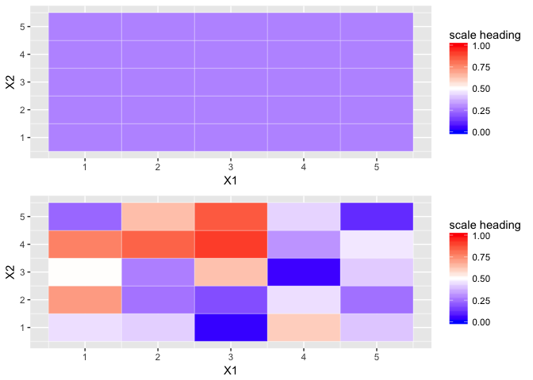

deSolve Brusselator
================

``` r
##
## install.packages("ReacTran")
##
## brusselator: "Solving Differential Equations in R", 9.3.2, Karline Soetart et al.
#
# https://cran.r-project.org/web/packages/diffEq/vignettes/PDEinR.pdf 
# https://www.rdocumentation.org/packages/deSolve/versions/1.20/topics/ode.2D
#

brusselator2D <- function(t, y, parms) {
  
  X1 <- matrix(nrow=Nx, ncol=Ny, data=y[1:(Nx*Ny)])
  X2 <- matrix(nrow=Nx, ncol=Ny, data=y[(Nx*Ny+1):(2*Nx*Ny)])
  
  dX1 <- 1 + X1^2*X2 - 4*X1 +
    tran.2D(C=X1, D.x=D_X1, D.y=D_X1, dx=Gridx, dy=Gridy)$dC
  
  dX2 <- 3*X1 - X1^2*X2 + 
    tran.2D(C=X2, D.x=D_X2, D.y=D_X2, dx=Gridx, dy=Gridy)$dC
  
  list(c(dX1, dX2))
}

require(ReacTran)
```

    ## Loading required package: ReacTran

    ## Loading required package: rootSolve

    ## Loading required package: deSolve

    ## Loading required package: shape

``` r
require(deSolve)

Nx <- 5
Ny <- 5
Gridx <- setup.grid.1D(x.up = 0, x.down = 1, N = Nx)  
Gridy <- setup.grid.1D(x.up = 0, x.down = 1, N = Ny)

D_X1 <- 2          # two diffusion coefficients that generate interesting patterns
D_X2 <- 8 * D_X1

X1ini <- matrix(nrow=Nx, ncol=Ny, data=runif(Nx*Ny)) # random initial conditions
X2ini <- matrix(nrow=Nx, ncol=Ny, data=runif(Nx*Ny))

yini <- c(X1ini, X2ini)  # a vector of 50 numbers between 0 and 1

times <- 0:8

# lrw = size of the work space
# nspc = number of modelled components
#
print(system.time(
  out <- ode.2D(y=yini, parms=NULL, func=brusselator2D, 
                nspec=2, dimens=c(Nx, Ny), times=times, 
                lrw=2000000, names=c("X1", "X2"))
))
```

    ##    user  system elapsed 
    ##   0.546   0.018   0.571

``` r
# > skim(out)
# No skim method exists for class deSolvematrix.
# > summary(out)
#                   X1           X2
# Min.        0.001202 1.402000e-04
# 1st Qu.     0.289200 1.382000e+00
# Median      0.383800 2.769000e+00
# Mean        0.773400 2.697000e+00
# 3rd Qu.     0.703400 4.011000e+00
# Max.        3.701000 4.719000e+00
# N       22500.000000 2.250000e+04  22,500 values for x and y
# sd          1.046993 1.489611e+00
# > is.array(out)
# [1] TRUE
# > is.matrix(out)
# [1] TRUE
# > nrow(out)     # one row for each time value
# [1] 9
# > ncol(out)     # 50x50 = 2,500 cells for each 'property' 
#                   = 5,000 + 1 cells per time value (45,009 total)
# [1] 5001
# > 
# > head(out[,1:5])
#     time         1         2         3         4
#[1,]    0 0.8071870 0.1053788 0.4744620 0.5969623
#[2,]    1 0.2790019 0.2790019 0.2790019 0.2790019
#[3,]    2 0.2891623 0.2891623 0.2891623 0.2891623
#[4,]    3 0.3105695 0.3105695 0.3105695 0.3105695
#[5,]    4 0.3399305 0.3399305 0.3399305 0.3399305
#[6,]    5 0.3837966 0.3837966 0.3837966 0.3837966
#> 

par(oma=c(0,0,1,0), mar=rep(4,4)) # oma = increase the size of the outer margin

# https://www.rdocumentation.org/packages/deSolve/versions/1.20/topics/plot.deSolve

# for the matrix 'out', the first column represnts time, 
# the next N columns contain profiles ( [2: (N+1)] )
#                    # for a 5x5 test matrix, after column 'time', 
# out[1,1:26] <- 0   # the next 25 data columns are data for equation X1
# out[2,27:51] <- 0  # then, the trailing 25 data columns are data for equation X2
#
ggRow <- 3
ggData.matrix <- cbind(out[ggRow,2:6], out[ggRow,7:11], 
                   out[ggRow,12:16], out[ggRow,17:21],
                   out[ggRow,22:26])
# http://www.sthda.com/english/wiki/ggplot2-quick-correlation-matrix-heatmap-r-software-and-data-visualization
library(reshape)
melt.ed <- melt(ggData.matrix)
library(ggplot2)
library(gridExtra)
gg1 <- ggplot(data = melt.ed, aes(x=X1, y=X2, fill=value)) + 
  geom_tile(color = "white") +
  scale_fill_gradient2(low = "blue", high = "red", mid = "white", 
                       midpoint = .5, limit = c(0,1),
                       name="scale heading")

ggRow <- 7
ggData.matrix <- cbind(out[ggRow,2:6], out[ggRow,7:11], 
                   out[ggRow,12:16], out[ggRow,17:21],
                   out[ggRow,22:26])
melt.ed <- melt(ggData.matrix)
gg2 <- ggplot(data = melt.ed, aes(x=X1, y=X2, fill=value)) + 
  geom_tile(color = "white") +
  scale_fill_gradient2(low = "blue", high = "red", mid = "white", 
                       midpoint = .5, limit = c(0,1),
                       name="scale heading")

grid.arrange(gg1, gg2)
```



``` r
# 'which' extracts a 'property' representing solution values for one of the equations (pg 160)
image(out, which="X1", xlab="x", ylab="y", mfrow = c(3,3), ask=FALSE,
      main=paste("t= ", times),
      grid= list(x=Gridx$x.mid, y=Gridy$x.mid))
mtext(side=3, outer=TRUE, cex=1.5, line=-1, 
      "2d brusselator, species X1")
```


