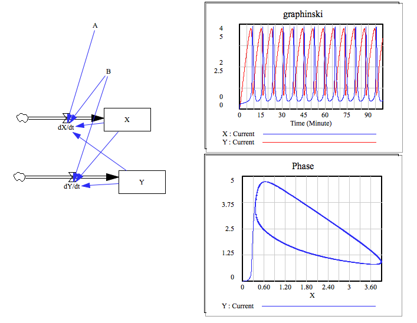
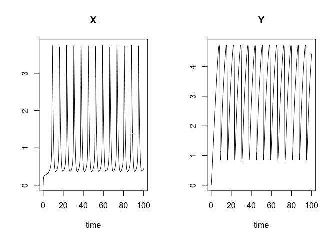
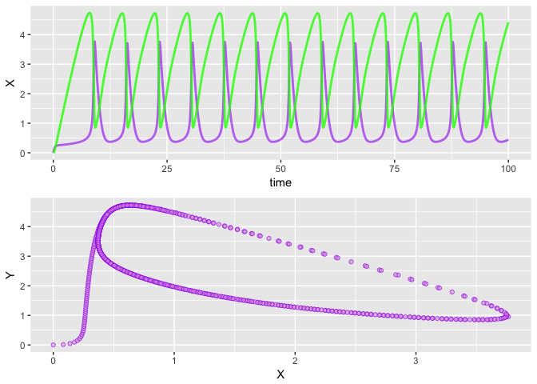

simecol Belousov Zhabotinski reaction
================

### vensim mode 
 




### simecol mode 

``` r
library("simecol")
```

    ## Loading required package: deSolve

``` r
bz.model <- new("odeModel",                   # object class = 'odeModel'
                
         main = function(times, y, parms) {   # object method
                                              # simecol magic: 2nd argument 'y' points to 'init'
          with(as.list(c(parms, y)), {        
            dXdt <- A + X^2 * Y - B* X - X
            dYdt <- B * X - X^2 * Y
            list(c(dXdt, dYdt))               # object attributes (data) 
           })
         },
         
        times = seq(0, 100, 0.1),
        parms = c(A=1, B=3),
        init = c(X=0, Y=0),
        solver = "lsoda"                      # 'lsoda' available for 'odemodel' class
        
      )
```

``` r
bz.sim <- sim(bz.model)
plot(bz.sim)
```



``` r
plotupca <- function(obj, ...) {
  
  library(gridExtra)
  library(ggplot2)
  
  o.df <- out(obj)  # output a dataframe
  
  gg1 <- ggplot()  +
    geom_line(aes(x=time, y=X), o.df,  
        colour = "purple", size=1, alpha=0.6)  +
    geom_line(aes(x=time, y=Y), o.df, colour = "green", size=1, alpha=0.8)
  
  gg2 <- ggplot()  +
    geom_point(aes(x=X, y=Y), o.df,  
        shape=21, colour = "purple", fill = "plum", alpha=0.6) 
  
  grid.arrange(gg1, gg2)

}
```

``` r
 plotupca(bz.sim)
```



``` r
head(out(bz.sim))
```

    ##   time          X          Y
    ## 1  0.0 0.00000000 0.00000000
    ## 2  0.1 0.08242079 0.01318391
    ## 3  0.2 0.13770402 0.04671151
    ## 4  0.3 0.17487835 0.09378642
    ## 5  0.4 0.20000895 0.14982979
    ## 6  0.5 0.21715500 0.21177199

``` r
main(bz.sim)
```

    ## function(times, y, parms) {   # object method
    ##                                               # simecol magic: 2nd argument 'y' points to 'init'
    ##           with(as.list(c(parms, y)), {        
    ##             dXdt <- A + X^2 * Y - B* X - X
    ##             dYdt <- B * X - X^2 * Y
    ##             list(c(dXdt, dYdt))               # object attributes (data) 
    ##            })
    ##          }

``` r
init(bz.sim)
```

    ## X Y 
    ## 0 0

``` r
parms(bz.sim)
```

    ## A B 
    ## 1 3

``` r
equations(bz.sim)
```

    ## NULL

``` r
solver(bz.sim)
```

    ## [1] "lsoda"

``` r
class(bz.sim)
```

    ## [1] "odeModel"
    ## attr(,"package")
    ## [1] "simecol"

``` r
str(bz.sim)
```

    ## Formal class 'odeModel' [package "simecol"] with 10 slots
    ##   ..@ parms    : Named num [1:2] 1 3
    ##   .. ..- attr(*, "names")= chr [1:2] "A" "B"
    ##   ..@ init     : Named num [1:2] 0 0
    ##   .. ..- attr(*, "names")= chr [1:2] "X" "Y"
    ##   ..@ observer : NULL
    ##   ..@ main     :function (times, y, parms)  
    ##   .. ..- attr(*, "srcref")=Class 'srcref'  atomic [1:8] 5 17 12 10 17 10 5 12
    ##   .. .. .. ..- attr(*, "srcfile")=Classes 'srcfilecopy', 'srcfile' <environment: 0x7fc812cc28d0> 
    ##   ..@ equations: NULL
    ##   ..@ times    : num [1:1001] 0 0.1 0.2 0.3 0.4 0.5 0.6 0.7 0.8 0.9 ...
    ##   ..@ inputs   : NULL
    ##   ..@ solver   : chr "lsoda"
    ##   ..@ out      : deSolve [1:1001, 1:3] 0 0.1 0.2 0.3 0.4 0.5 0.6 0.7 0.8 0.9 ...
    ##   .. ..- attr(*, "dimnames")=List of 2
    ##   .. .. ..$ : NULL
    ##   .. .. ..$ : chr [1:3] "time" "X" "Y"
    ##   .. ..- attr(*, "istate")= int [1:21] 2 1707 3651 NA 6 6 0 52 22 NA ...
    ##   .. ..- attr(*, "rstate")= num [1:5] 0.1 0.1 100.1 0 0
    ##   .. ..- attr(*, "lengthvar")= int 2
    ##   .. ..- attr(*, "class")= chr [1:2] "deSolve" "matrix"
    ##   .. ..- attr(*, "type")= chr "lsoda"
    ##   ..@ initfunc : NULL
