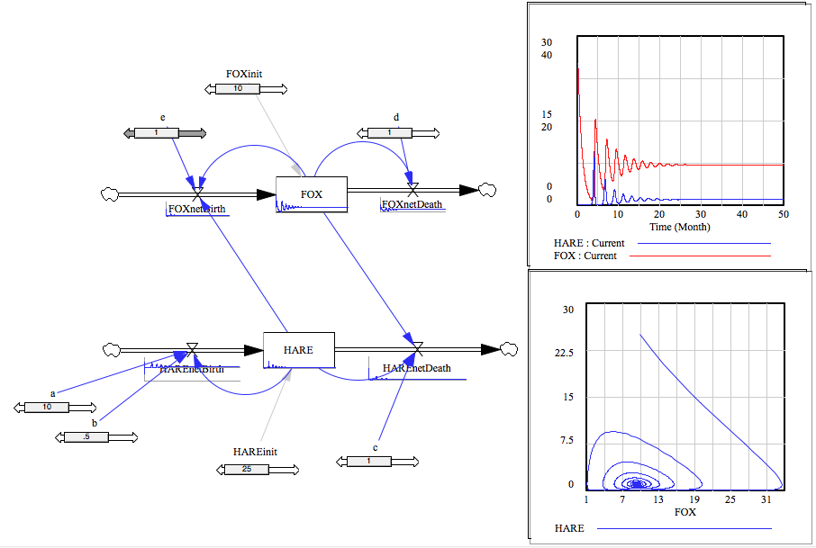
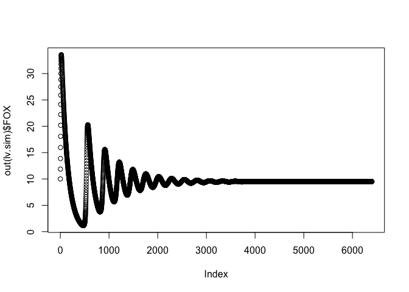
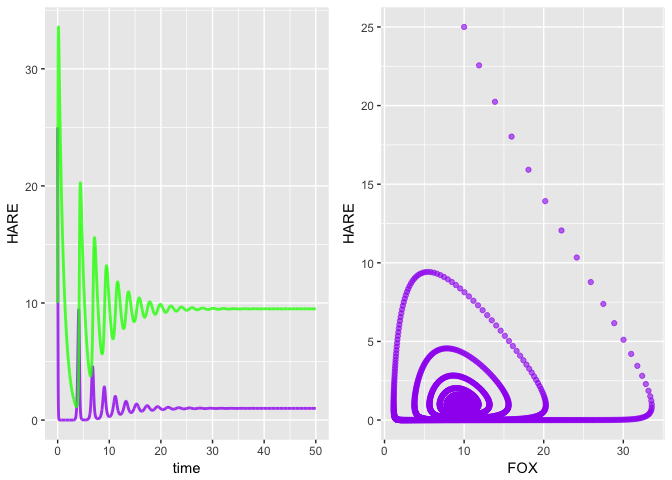

simecol Lotka-Volterra
================

### vensim mode 
 




### simecol mode 

``` r
library("simecol")
```

    ## Loading required package: deSolve

``` r
lv.model <- new("odeModel",                   # object class = 'odeModel'
                
         main = function(time, y, parms) {   # object method
                                              # simecol magic: 2nd argument 'y' points to 'init'
          with(as.list(c(parms, y)), {

            dHARE <- (a - b * HARE - c * FOX) * HARE
            dFOX <- (-d + e * HARE) * FOX
            
            # a, b, c, d, and e are positive constants to be determined from field research.
            # writing dHARE = alpha * HARE, then alpha = a - b*HARE - c*FOX
            # which is the net birth rate for hares. When FOX=0, this is the logistics
            # equation. alpha is the intrinsic growth rate of hare 
            # a/b is the carrying capacity in the absence of fox.
            # if FOX > 0, the term -c*FOX*HARE models the predator effect of FOX
            #
            # net birth rate of FOX = -d + e*HARE
            # if HARE = 0, then FOX goes to 0
            # the term + e*HARE*FOX models the positive effect of hares on the birth
            # rate of foxes. 
          
            list(c(dFOX, dHARE))
           })
         },
         
         #.0078125
        times = seq(0, 50, .0078125), 
        parms = c(a=10, b=.5, c=1, d=1, e=1),
        init = c(FOX=10, HARE=25),
        solver = "euler"                      # 'lsoda' available for 'odemodel' class
        
      )
```

``` r
lv.sim <- sim(lv.model)
plot(out(lv.sim)$FOX)
```



``` r
plotupca <- function(obj, ...) {
  
  library(gridExtra)
  library(ggplot2)
  
  o.df <- out(obj)  # output a dataframe
  
  gg1 <- ggplot()  +
    geom_line(aes(x=time, y=HARE), o.df, colour = "purple", size=1, alpha=0.8)  +
    geom_line(aes(x=time, y=FOX), o.df, colour = "green", size=1, alpha=0.8)
  
  gg2 <- ggplot()  +
    geom_point(aes(x=FOX, y=HARE), o.df,  colour = "purple", alpha=0.6) 
  
  
  grid.arrange(gg1, gg2, ncol=2, nrow=1)

}
```

``` r
 plotupca(lv.sim)
```



``` r
head(out(lv.sim))
```

    ##        time      FOX     HARE
    ## 1 0.0000000 10.00000 25.00000
    ## 2 0.0078125 11.87500 22.55859
    ## 3 0.0156250 13.87506 20.24029
    ## 4 0.0234375 15.96069 18.02727
    ## 5 0.0312500 18.08387 15.91831
    ## 6 0.0390625 20.19154 13.92317

``` r
main(lv.sim)
```

    ## function(time, y, parms) {   # object method
    ##                                               # simecol magic: 2nd argument 'y' points to 'init'
    ##           with(as.list(c(parms, y)), {
    ## 
    ##             dHARE <- (a - b * HARE - c * FOX) * HARE
    ##             dFOX <- (-d + e * HARE) * FOX
    ##             
    ##             # a, b, c, d, and e are positive constants to be determined from field research.
    ##             # writing dHARE = alpha * HARE, then alpha = a - b*HARE - c*FOX
    ##             # which is the net birth rate for hares. When FOX=0, this is the logistics
    ##             # equation. alpha is the intrinsic growth rate of hare 
    ##             # a/b is the carrying capacity in the absence of fox.
    ##             # if FOX > 0, the term -c*FOX*HARE models the predator effect of FOX
    ##             #
    ##             # net birth rate of FOX = -d + e*HARE
    ##             # if HARE = 0, then FOX goes to 0
    ##             # the term + e*HARE*FOX models the positive effect of hares on the birth
    ##             # rate of foxes. 
    ##           
    ##             list(c(dFOX, dHARE))
    ##            })
    ##          }

``` r
init(lv.sim)
```

    ##  FOX HARE 
    ##   10   25

``` r
parms(lv.sim)
```

    ##    a    b    c    d    e 
    ## 10.0  0.5  1.0  1.0  1.0

``` r
equations(lv.sim)
```

    ## NULL

``` r
solver(lv.sim)
```

    ## [1] "euler"

``` r
class(lv.sim)
```

    ## [1] "odeModel"
    ## attr(,"package")
    ## [1] "simecol"

``` r
str(lv.sim)
```

    ## Formal class 'odeModel' [package "simecol"] with 10 slots
    ##   ..@ parms    : Named num [1:5] 10 0.5 1 1 1
    ##   .. ..- attr(*, "names")= chr [1:5] "a" "b" "c" "d" ...
    ##   ..@ init     : Named num [1:2] 10 25
    ##   .. ..- attr(*, "names")= chr [1:2] "FOX" "HARE"
    ##   ..@ observer : NULL
    ##   ..@ main     :function (time, y, parms)  
    ##   .. ..- attr(*, "srcref")=Class 'srcref'  atomic [1:8] 6 17 27 10 17 10 6 27
    ##   .. .. .. ..- attr(*, "srcfile")=Classes 'srcfilecopy', 'srcfile' <environment: 0x7f924ae0fe00> 
    ##   ..@ equations: NULL
    ##   ..@ times    : num [1:6401] 0 0.00781 0.01562 0.02344 0.03125 ...
    ##   ..@ inputs   : NULL
    ##   ..@ solver   : chr "euler"
    ##   ..@ out      : deSolve [1:6401, 1:3] 0 0.00781 0.01562 0.02344 0.03125 ...
    ##   .. ..- attr(*, "istate")= int [1:21] 0 6400 6401 NA NA NA NA NA NA NA ...
    ##   .. ..- attr(*, "dimnames")=List of 2
    ##   .. .. ..$ : NULL
    ##   .. .. ..$ : chr [1:3] "time" "FOX" "HARE"
    ##   .. ..- attr(*, "lengthvar")= int 2
    ##   .. ..- attr(*, "class")= chr [1:2] "deSolve" "matrix"
    ##   .. ..- attr(*, "type")= chr "rk"
    ##   ..@ initfunc : NULL
