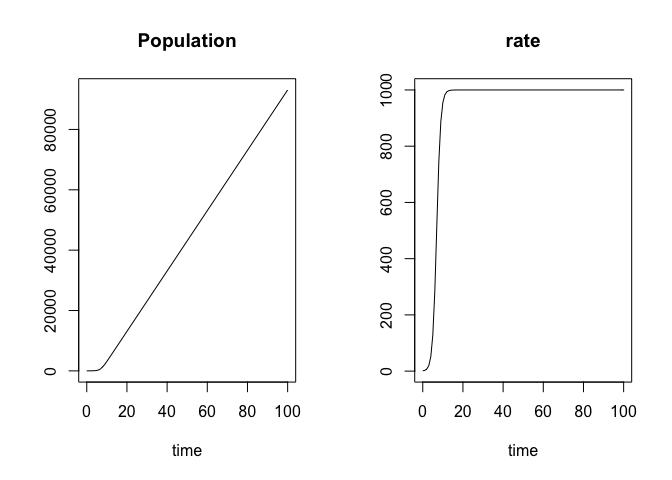
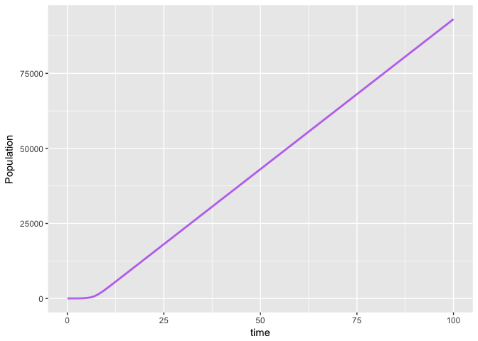

simecol logistic growth
================

``` r
library("simecol")
```

    ## Loading required package: deSolve

``` r
lg.model <- new("odeModel",                   # object class = 'odeModel'
                
         main = function(times, y, parms) {   # object method
                                              # simecol magic: 2nd argument 'y' points to 'init'
          with(as.list(c(parms, y)), { 
            
            Population <- rate
              rate <- growthConstant * Population * (1 - Population / Limit )
              
            list(c(Population, rate))    # object attributes (data) 
           })
         },
         
        times = seq(0, 100, 1),
        parms = c(growthConstant=1, Limit=1000),
        init = c(Population=10, rate=1),
        
        solver = "rk4"                      # 'lsoda' available for 'odemodel' class
        
      )
```

``` r
lg.sim <- sim(lg.model)
plot(lg.sim)
```



``` r
plotupca <- function(obj, ...) {
  
  library(gridExtra)
  library(ggplot2)
  
  o.df <- out(obj)  # output a dataframe
  
  gg1 <- ggplot()  +
    geom_line(aes(x=time, y=Population), o.df,  
        colour = "purple", size=1, alpha=0.6)  
 
  
  grid.arrange(gg1)

}
```

``` r
 plotupca(lg.sim)
```



``` r
head(out(lg.sim))
```

    ##   time Population       rate
    ## 1    0   10.00000   1.000000
    ## 2    1   11.70697   2.703778
    ## 3    2   16.31597   7.289523
    ## 4    3   28.69685  19.502838
    ## 5    4   61.50378  51.137782
    ## 6    5  145.44765 127.480459

``` r
main(lg.sim)
```

    ## function(times, y, parms) {   # object method
    ##                                               # simecol magic: 2nd argument 'y' points to 'init'
    ##           with(as.list(c(parms, y)), { 
    ##             
    ##             Population <- rate
    ##            rate <- growthConstant * Population * (1 - Population / Limit )
    ##            
    ##             list(c(Population, rate))    # object attributes (data) 
    ##            })
    ##          }

``` r
init(lg.sim)
```

    ## Population       rate 
    ##         10          1

``` r
parms(lg.sim)
```

    ## growthConstant          Limit 
    ##              1           1000

``` r
equations(lg.sim)
```

    ## NULL

``` r
solver(lg.sim)
```

    ## [1] "rk4"

``` r
class(lg.sim)
```

    ## [1] "odeModel"
    ## attr(,"package")
    ## [1] "simecol"

``` r
str(lg.sim)
```

    ## Formal class 'odeModel' [package "simecol"] with 10 slots
    ##   ..@ parms    : Named num [1:2] 1 1000
    ##   .. ..- attr(*, "names")= chr [1:2] "growthConstant" "Limit"
    ##   ..@ init     : Named num [1:2] 10 1
    ##   .. ..- attr(*, "names")= chr [1:2] "Population" "rate"
    ##   ..@ observer : NULL
    ##   ..@ main     :function (times, y, parms)  
    ##   .. ..- attr(*, "srcref")=Class 'srcref'  atomic [1:8] 6 17 15 10 17 10 6 15
    ##   .. .. .. ..- attr(*, "srcfile")=Classes 'srcfilecopy', 'srcfile' <environment: 0x7f9a49b166e0> 
    ##   ..@ equations: NULL
    ##   ..@ times    : num [1:101] 0 1 2 3 4 5 6 7 8 9 ...
    ##   ..@ inputs   : NULL
    ##   ..@ solver   : chr "rk4"
    ##   ..@ out      : deSolve [1:101, 1:3] 0 1 2 3 4 5 6 7 8 9 ...
    ##   .. ..- attr(*, "istate")= int [1:21] 0 100 401 NA NA NA NA NA NA NA ...
    ##   .. ..- attr(*, "dimnames")=List of 2
    ##   .. .. ..$ : NULL
    ##   .. .. ..$ : chr [1:3] "time" "Population" "rate"
    ##   .. ..- attr(*, "lengthvar")= int 2
    ##   .. ..- attr(*, "class")= chr [1:2] "deSolve" "matrix"
    ##   .. ..- attr(*, "type")= chr "rk"
    ##   ..@ initfunc : NULL
