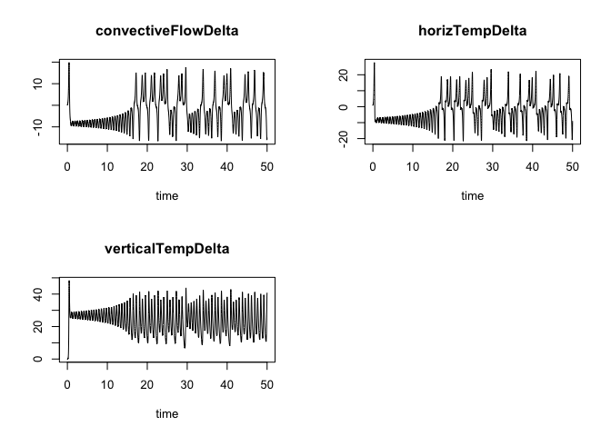
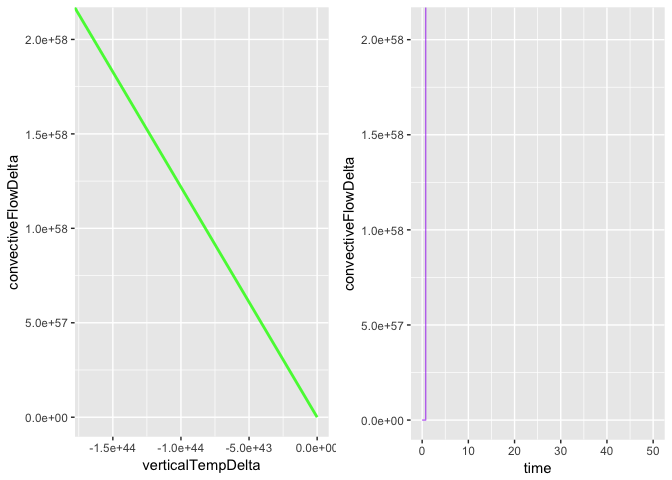

simecol lorenz
================

``` r
library("simecol")
```

    ## Loading required package: deSolve

``` r
lorenz.model <- new("odeModel",                   # object class = 'odeModel'
                
         main = function(times, y, parms) {   # object method
                                              # simecol magic: 2nd argument 'y' points to 'init'
          with(as.list(c(parms, y)), {

            horizTempDt <- ( convectiveFlowDelta * ( rayleigh - verticalTempDelta ) ) - horizTempDelta
            verticalTempDt <- (convectiveFlowDelta * horizTempDelta) - (height * verticalTempDelta)
            convectiveFlowDt <- prandtl * ( horizTempDelta - convectiveFlowDelta )
            
            horizTempDelta <- horizTempDt
            verticalTempDelta <- verticalTempDt
            convectiveFlowDelta <- convectiveFlowDt
          
            list(c(convectiveFlowDelta, horizTempDelta, verticalTempDelta)) # *match order with init() *
           })
         },
         
         #.0078125
        times = seq(0, 50, .0078125), 
        parms = c(prandtl=10, rayleigh=28, height=8/3), # 2.66666666667
        init = c(convectiveFlowDelta=0, horizTempDelta=1, verticalTempDelta=0), # *match order with list() *
        solver = "lsoda"  # use "lsoda" instead of "rk4". It is faster and more precise.
        
      )
```

``` r
lorenz.sim <- sim(lorenz.model)
plot(lorenz.sim)
```



``` r
plotupca <- function(obj, ...) {
  
  library(gridExtra)
  library(ggplot2)
  
  o.df <- out(obj)  # output a dataframe
  
  gg1 <- ggplot()  +
    geom_path(aes(x=verticalTempDelta, y=convectiveFlowDelta), o.df, colour = "green", size=1, alpha=0.8)
  
  gg2 <- ggplot()  +
    geom_line(aes(x=time, y=convectiveFlowDelta), o.df,  colour = "purple", alpha=0.6) 
  
  
  grid.arrange(gg1, gg2, ncol=2, nrow=1)

}
```

``` r
 plotupca(lorenz.sim)
```



``` r
head(out(lorenz.sim))
```

    ##        time convectiveFlowDelta horizTempDelta verticalTempDelta
    ## 1 0.0000000          0.00000000       1.000000      0.0000000000
    ## 2 0.0078125          0.07506709       1.000514      0.0002947338
    ## 3 0.0156250          0.14514002       1.016805      0.0011507602
    ## 4 0.0234375          0.21173848       1.047831      0.0025537160
    ## 5 0.0312500          0.27620038       1.092866      0.0045218346
    ## 6 0.0390625          0.33972050       1.151467      0.0071017494

``` r
main(lorenz.sim)
```

    ## function(times, y, parms) {   # object method
    ##                                               # simecol magic: 2nd argument 'y' points to 'init'
    ##           with(as.list(c(parms, y)), {
    ## 
    ##             horizTempDt <- ( convectiveFlowDelta * ( rayleigh - verticalTempDelta ) ) - horizTempDelta
    ##             verticalTempDt <- (convectiveFlowDelta * horizTempDelta) - (height * verticalTempDelta)
    ##             convectiveFlowDt <- prandtl * ( horizTempDelta - convectiveFlowDelta )
    ##             
    ##             horizTempDelta <- horizTempDt
    ##             verticalTempDelta <- verticalTempDt
    ##             convectiveFlowDelta <- convectiveFlowDt
    ##           
    ##             list(c(convectiveFlowDelta, horizTempDelta, verticalTempDelta)) # *match order with init() *
    ##            })
    ##          }

``` r
init(lorenz.sim)
```

    ## convectiveFlowDelta      horizTempDelta   verticalTempDelta 
    ##                   0                   1                   0

``` r
parms(lorenz.sim)
```

    ##   prandtl  rayleigh    height 
    ## 10.000000 28.000000  2.666667

``` r
equations(lorenz.sim)
```

    ## NULL

``` r
solver(lorenz.sim)
```

    ## [1] "lsoda"

``` r
class(lorenz.sim)
```

    ## [1] "odeModel"
    ## attr(,"package")
    ## [1] "simecol"

``` r
str(lorenz.sim)
```

    ## Formal class 'odeModel' [package "simecol"] with 10 slots
    ##   ..@ parms    : Named num [1:3] 10 28 2.67
    ##   .. ..- attr(*, "names")= chr [1:3] "prandtl" "rayleigh" "height"
    ##   ..@ init     : Named num [1:3] 0 1 0
    ##   .. ..- attr(*, "names")= chr [1:3] "convectiveFlowDelta" "horizTempDelta" "verticalTempDelta"
    ##   ..@ observer : NULL
    ##   ..@ main     :function (times, y, parms)  
    ##   .. ..- attr(*, "srcref")=Class 'srcref'  atomic [1:8] 6 17 20 10 17 10 6 20
    ##   .. .. .. ..- attr(*, "srcfile")=Classes 'srcfilecopy', 'srcfile' <environment: 0x7f813954ca98> 
    ##   ..@ equations: NULL
    ##   ..@ times    : num [1:6401] 0 0.00781 0.01562 0.02344 0.03125 ...
    ##   ..@ inputs   : NULL
    ##   ..@ solver   : chr "lsoda"
    ##   ..@ out      : deSolve [1:6401, 1:4] 0 0.00781 0.01562 0.02344 0.03125 ...
    ##   .. ..- attr(*, "dimnames")=List of 2
    ##   .. .. ..$ : NULL
    ##   .. .. ..$ : chr [1:4] "time" "convectiveFlowDelta" "horizTempDelta" "verticalTempDelta"
    ##   .. ..- attr(*, "istate")= int [1:21] 2 6800 13581 NA 6 6 0 68 23 NA ...
    ##   .. ..- attr(*, "rstate")= num [1:5] 0.00781 0.00781 50.00359 0 43.98515
    ##   .. ..- attr(*, "lengthvar")= int 3
    ##   .. ..- attr(*, "class")= chr [1:2] "deSolve" "matrix"
    ##   .. ..- attr(*, "type")= chr "lsoda"
    ##   ..@ initfunc : NULL
