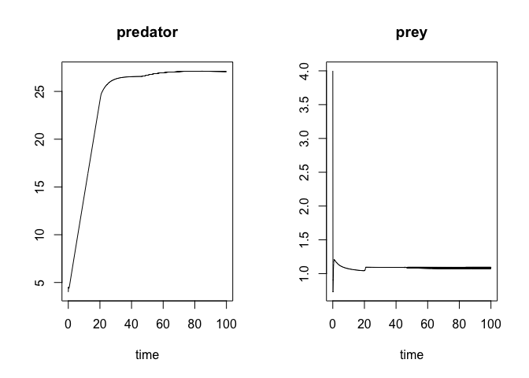

simecol predator prey
================

### vensim mode 
 


### simecol mode 


``` r
# also : https://unamatematicaseltigre.blogspot.com/2016/09/population-growth-models-using-rsimecol.html

library("simecol")
```

    ## Loading required package: deSolve

``` r
pp.model <- new("odeModel",                   # object class = 'odeModel'
                
         main = function(times, y, parms) {   # object method
                                              # simecol magic: 2nd argument 'y' points to 'init'
          with(as.list(c(parms, y)), {        

            #predator <- newPred - dying  
            #prey <- newPrey - killed 
            
            predator <- multiply(birthraeY, multiply(predator, prey))-multiply(deathrate, predator)  
            prey <- multiply(prey, birthrateX)-multiply(killrate, multiply(predator, prey))
            
            #newPred <- multiply(birthraeY, encounter)
            #newPrey <- multiply(prey, birthrateX)
            
            #dying <- multiply(deathrate, predator)
            
            #killed <- multiply(killrate, encounter)
            #killed <- multiply(killrate, multiply(predator, prey))
            
            #encounter <- multiply(predator, prey)
    
            list(c(predator, prey))    # object attributes (data) 
           })
         },
         equations = list(
           multiply = function(i, j) {i*j}
         ),
        times = seq(0, 100, 0.125), # 0.125
        parms = c(birthraeY=1, birthrateX=1, deathrate=1, killrate=1),
        init = c(predator=4, prey=4),
        solver = "rk4"                      # 'lsoda' available for 'odemodel' class
        
      )
```

``` r
pp.sim <- sim(pp.model)
plot(pp.sim)
```



``` r
plotupca <- function(obj, ...) {
  
  library(gridExtra)
  library(ggplot2)
  
  o.df <- out(obj)  # output a dataframe
  
  gg1 <- ggplot()  +
    geom_line(aes(x=time, y=predator), o.df,  
        colour = "purple", size=1, alpha=0.6)  +
    geom_line(aes(x=time, y=prey), o.df, colour = "green", size=1, alpha=0.8)
  
  gg2 <- ggplot()  +
    geom_line(aes(x=prey, y=predator), o.df,  colour = "purple", alpha=0.6) +
    scale_x_continuous(limits = c(1.025, 1.1)) 
    #scale_y_continuous(limits = c(0, 2))
  
  grid.arrange(gg1, gg2)

}
```

``` r
 plotupca(pp.sim)
```

    ## Warning: Removed 78 rows containing missing values (geom_path).


``` r
head(out(pp.sim))
```

    ##    time predator      prey
    ## 1 0.000 4.000000 4.0000000
    ## 2 0.125 4.511729 0.7275719
    ## 3 0.250 4.412768 0.9101596
    ## 4 0.375 4.402155 1.0422988
    ## 5 0.500 4.450588 1.1252063
    ## 6 0.625 4.535337 1.1714053

``` r
main(pp.sim)
```

    ## function(times, y, parms) {   # object method
    ##                                               # simecol magic: 2nd argument 'y' points to 'init'
    ##           with(as.list(c(parms, y)), {        
    ## 
    ##             #predator <- newPred - dying  
    ##             #prey <- newPrey - killed 
    ##             
    ##             predator <- multiply(birthraeY, multiply(predator, prey))-multiply(deathrate, predator)  
    ##             prey <- multiply(prey, birthrateX)-multiply(killrate, multiply(predator, prey))
    ##             
    ##             #newPred <- multiply(birthraeY, encounter)
    ##             #newPrey <- multiply(prey, birthrateX)
    ##             
    ##             #dying <- multiply(deathrate, predator)
    ##             
    ##             #killed <- multiply(killrate, encounter)
    ##             #killed <- multiply(killrate, multiply(predator, prey))
    ##             
    ##             #encounter <- multiply(predator, prey)
    ##  
    ##             list(c(predator, prey))    # object attributes (data) 
    ##            })
    ##          }

``` r
init(pp.sim)
```

    ## predator     prey 
    ##        4        4

``` r
parms(pp.sim)
```

    ##  birthraeY birthrateX  deathrate   killrate 
    ##          1          1          1          1

``` r
equations(pp.sim)
```

    ## $multiply
    ## function (i, j) 
    ## {
    ##     i * j
    ## }

``` r
solver(pp.sim)
```

    ## [1] "rk4"

``` r
class(pp.sim)
```

    ## [1] "odeModel"
    ## attr(,"package")
    ## [1] "simecol"

``` r
str(pp.sim)
```

    ## Formal class 'odeModel' [package "simecol"] with 10 slots
    ##   ..@ parms    : Named num [1:4] 1 1 1 1
    ##   .. ..- attr(*, "names")= chr [1:4] "birthraeY" "birthrateX" "deathrate" "killrate"
    ##   ..@ init     : Named num [1:2] 4 4
    ##   .. ..- attr(*, "names")= chr [1:2] "predator" "prey"
    ##   ..@ observer : NULL
    ##   ..@ main     :function (times, y, parms)  
    ##   .. ..- attr(*, "srcref")=Class 'srcref'  atomic [1:8] 7 17 29 10 17 10 7 29
    ##   .. .. .. ..- attr(*, "srcfile")=Classes 'srcfilecopy', 'srcfile' <environment: 0x7fbb00c84230> 
    ##   ..@ equations:List of 1
    ##   .. ..$ multiply:function (i, j)  
    ##   .. .. ..- attr(*, "srcref")=Class 'srcref'  atomic [1:8] 31 23 31 42 23 42 31 31
    ##   .. .. .. .. ..- attr(*, "srcfile")=Classes 'srcfilecopy', 'srcfile' <environment: 0x7fbb00c84230> 
    ##   ..@ times    : num [1:801] 0 0.125 0.25 0.375 0.5 ...
    ##   ..@ inputs   : NULL
    ##   ..@ solver   : chr "rk4"
    ##   ..@ out      : deSolve [1:801, 1:3] 0 0.125 0.25 0.375 0.5 ...
    ##   .. ..- attr(*, "istate")= int [1:21] 0 800 3201 NA NA NA NA NA NA NA ...
    ##   .. ..- attr(*, "dimnames")=List of 2
    ##   .. .. ..$ : NULL
    ##   .. .. ..$ : chr [1:3] "time" "predator" "prey"
    ##   .. ..- attr(*, "lengthvar")= int 2
    ##   .. ..- attr(*, "class")= chr [1:2] "deSolve" "matrix"
    ##   .. ..- attr(*, "type")= chr "rk"
    ##   ..@ initfunc : NULL
