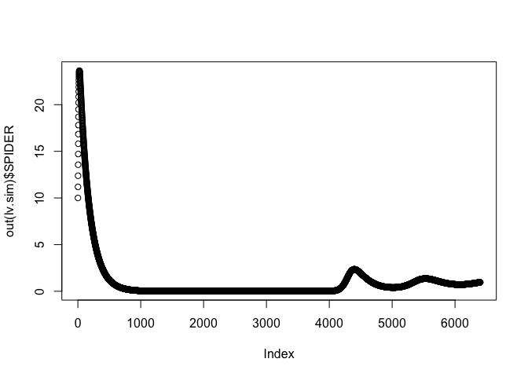
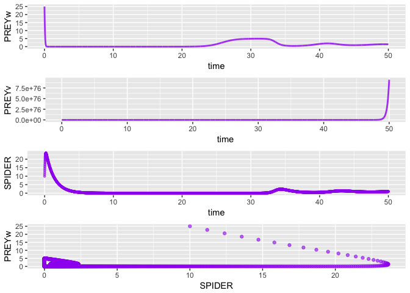

simecol spiders v2 'feeding saturation effect'
================

``` r
library("simecol")
```

    ## Loading required package: deSolve

``` r
# Spacio-Temporal Patterns of Ecology, case study: biological pest
# control in vineyards. Section 5.2
# changes in local prey abundance causes predator to search other prey habitats  
# 'feeding saturation effect' : Holling type II
#
lv.model <- new("odeModel",                   # object class = 'odeModel'
                
         main = function(time, y, parms) {   # object method
                                              # simecol magic: 2nd argument 'y' points to 'init'
          with(as.list(c(parms, y)), {

            dSPIDER <- SPIDER * ( -a + (k * b * PREYv)/(saturationConstantH + PREYv) + k * c * PREYw) # 
            dPREYw <- PREYw * r * (1 - PREYw/carryingCapacityW) - c * SPIDER * PREYw #
            dPREYv <- PREYv * (e - (b * SPIDER)/(saturationConstantH + PREYv)) # 
            
            SPIDER <- dSPIDER
            PREYw <- dPREYw
            PREYv <- dPREYv
          
            list(c(dSPIDER, dPREYw, dPREYv))
           })
         },
         
         #.0078125
        times = seq(0, 50, .0078125), 
        parms = c(a=3.1, b=2.87, c=0.8, e=3.5, r=1, carryingCapacityW=5, saturationConstantH=0.7, k=0.8),
        init = c(SPIDER=10, PREYw=25, PREYv=25),
        solver = "lsoda"                      # 'lsoda' available for 'odemodel' class
        
      )
```

``` r
lv.sim <- sim(lv.model)
plot(out(lv.sim)$SPIDER)
```



``` r
plotupca <- function(obj, ...) {
  
  library(gridExtra)
  library(ggplot2)
  
  o.df <- out(obj)  # output a dataframe
  
  gg1 <- ggplot()  +
    geom_line(aes(x=time, y=PREYw), o.df, colour = "purple", size=1, alpha=0.8)  
  
  gg2 <- ggplot()  +
    geom_line(aes(x=time, y=PREYv), o.df, colour = "purple", size=1, alpha=0.8) 
  
  gg3 <- ggplot()  +
    geom_point(aes(x=time, y=SPIDER), o.df,  colour = "purple", size=1, alpha=0.6) 
  
  gg4 <- ggplot()  +
    geom_point(aes(x=SPIDER, y=PREYw), o.df,  colour = "purple", alpha=0.6) 
  
  grid.arrange(gg1, gg2, gg3, gg4, ncol=1, nrow=4)

}
```

``` r
 plotupca(lv.sim)
```



``` r
head(out(lv.sim))
```

    ##        time   SPIDER    PREYw    PREYv
    ## 1 0.0000000 10.00000 25.00000 25.00000
    ## 2 0.0078125 11.19051 22.71921 25.45877
    ## 3 0.0156250 12.38474 20.56415 25.90372
    ## 4 0.0234375 13.56392 18.53626 26.33459
    ## 5 0.0312500 14.71037 16.63817 26.75150
    ## 6 0.0390625 15.80835 14.87247 27.15494

``` r
main(lv.sim)
```

    ## function(time, y, parms) {   # object method
    ##                                               # simecol magic: 2nd argument 'y' points to 'init'
    ##           with(as.list(c(parms, y)), {
    ## 
    ##             dSPIDER <- SPIDER * ( -a + (k * b * PREYv)/(saturationConstantH + PREYv) + k * c * PREYw) # 
    ##             dPREYw <- PREYw * r * (1 - PREYw/carryingCapacityW) - c * SPIDER * PREYw #
    ##             dPREYv <- PREYv * (e - (b * SPIDER)/(saturationConstantH + PREYv)) # 
    ##             
    ##             SPIDER <- dSPIDER
    ##             PREYw <- dPREYw
    ##             PREYv <- dPREYv
    ##           
    ##             list(c(dSPIDER, dPREYw, dPREYv))
    ##            })
    ##          }

``` r
init(lv.sim)
```

    ## SPIDER  PREYw  PREYv 
    ##     10     25     25

``` r
parms(lv.sim)
```

    ##                   a                   b                   c 
    ##                3.10                2.87                0.80 
    ##                   e                   r   carryingCapacityW 
    ##                3.50                1.00                5.00 
    ## saturationConstantH                   k 
    ##                0.70                0.80

``` r
equations(lv.sim)
```

    ## NULL

``` r
solver(lv.sim)
```

    ## [1] "lsoda"

``` r
class(lv.sim)
```

    ## [1] "odeModel"
    ## attr(,"package")
    ## [1] "simecol"

``` r
str(lv.sim)
```

    ## Formal class 'odeModel' [package "simecol"] with 10 slots
    ##   ..@ parms    : Named num [1:8] 3.1 2.87 0.8 3.5 1 5 0.7 0.8
    ##   .. ..- attr(*, "names")= chr [1:8] "a" "b" "c" "e" ...
    ##   ..@ init     : Named num [1:3] 10 25 25
    ##   .. ..- attr(*, "names")= chr [1:3] "SPIDER" "PREYw" "PREYv"
    ##   ..@ observer : NULL
    ##   ..@ main     :function (time, y, parms)  
    ##   .. ..- attr(*, "srcref")=Class 'srcref'  atomic [1:8] 11 17 25 10 17 10 11 25
    ##   .. .. .. ..- attr(*, "srcfile")=Classes 'srcfilecopy', 'srcfile' <environment: 0x7fec1348c3c8> 
    ##   ..@ equations: NULL
    ##   ..@ times    : num [1:6401] 0 0.00781 0.01562 0.02344 0.03125 ...
    ##   ..@ inputs   : NULL
    ##   ..@ solver   : chr "lsoda"
    ##   ..@ out      : deSolve [1:6401, 1:4] 0 0.00781 0.01562 0.02344 0.03125 ...
    ##   .. ..- attr(*, "dimnames")=List of 2
    ##   .. .. ..$ : NULL
    ##   .. .. ..$ : chr [1:4] "time" "SPIDER" "PREYw" "PREYv"
    ##   .. ..- attr(*, "istate")= int [1:21] 2 6410 12821 NA 6 6 0 68 23 NA ...
    ##   .. ..- attr(*, "rstate")= num [1:5] 0.00781 0.00781 50.00388 0 0
    ##   .. ..- attr(*, "lengthvar")= int 3
    ##   .. ..- attr(*, "class")= chr [1:2] "deSolve" "matrix"
    ##   .. ..- attr(*, "type")= chr "lsoda"
    ##   ..@ initfunc : NULL
