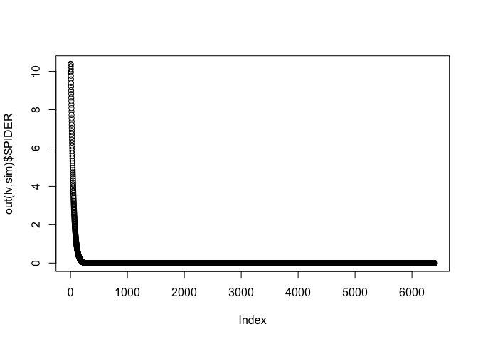
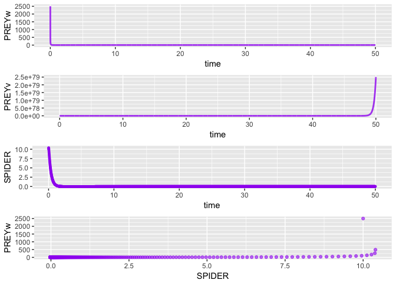

simecol spiders v3 'insecticide effects persist'
================

``` r
library("simecol")
```

    ## Loading required package: deSolve

``` r
# Spacio-Temporal Patterns of Ecology, case study: biological pest
# control in vineyards. Section 5.2
# changes in local prey abundance causes predator to search other prey habitats  
# assume exponential decay of pesticide effects
#
lv.model <- new("odeModel",                   # object class = 'odeModel'
                
         main = function(time, y, parms) {   # object method
                                              # simecol magic: 2nd argument 'y' points to 'init'
          with(as.list(c(parms, y)), {

            dSPIDER <- SPIDER * ( -a + (k * b * PREYv)/(saturationConstantH + PREYv) + k * c * PREYw) - h * K * q * psi(insecticideEfficiencyAlpha, time) # 
            dPREYw <- PREYw * r * (1 - PREYw/carryingCapacityW) - c * SPIDER * PREYw  - ( h * (1 - q) * psi(insecticideEfficiencyAlpha, time) ) #
            dPREYv <- PREYv * (e - (b * SPIDER)/(saturationConstantH + PREYv)) - ( h * q * psi(insecticideEfficiencyAlpha, time) ) # 
            
            SPIDER <- dSPIDER
            PREYw <- dPREYw
            PREYv <- dPREYv
          
            list(c(dSPIDER, dPREYw, dPREYv))
           })
         },
         equations = list(
           psi = function(insecticideEfficiencyAlpha, time) {exp(-insecticideEfficiencyAlpha*(time))},
           e = function() {exp(1)}
         ),
         #.0078125
        times = seq(0, 50, .0078125), 
        parms = c(a=3.1, b=2.87, c=0.8, e=3.5, r=1, carryingCapacityW=5, saturationConstantH=0.7, h=0.7, k=0.01, K=0.8, q=0.2, insecticideEfficiencyAlpha=0.2),
        init = c(SPIDER=10, PREYw=25, PREYv=25),
        solver = "euler"                      # 'lsoda' available for 'odemodel' class
        
      )
```

``` r
lv.sim <- sim(lv.model)
plot(out(lv.sim)$SPIDER)
```



``` r
plotupca <- function(obj, ...) {
  
  library(gridExtra)
  library(ggplot2)
  
  o.df <- out(obj)  # output a dataframe
  
  gg1 <- ggplot()  +
    geom_line(aes(x=time, y=PREYw), o.df, colour = "purple", size=1, alpha=0.8)  
  
  gg2 <- ggplot()  +
    geom_line(aes(x=time, y=PREYv), o.df, colour = "purple", size=1, alpha=0.8) 
  
  gg3 <- ggplot()  +
    geom_point(aes(x=time, y=SPIDER), o.df,  colour = "purple", size=1, alpha=0.6) 
  
  gg4 <- ggplot()  +
    geom_point(aes(x=SPIDER, y=PREYw), o.df,  colour = "purple", alpha=0.6) 
  
  grid.arrange(gg1, gg2, gg3, gg4, ncol=1, nrow=4)

}
```

``` r
 plotupca(lv.sim)
```



``` r
head(out(lv.sim))
```

    ##        time    SPIDER    PREYw    PREYv
    ## 1 0.0000000 10.000000 25.00000 25.00000
    ## 2 0.0078125  9.774744 22.65188 25.46439
    ## 3 0.0156250  9.553109 20.63889 25.94628
    ## 4 0.0234375  9.335281 18.89792 26.44609
    ## 5 0.0312500  9.121387 17.38058 26.96422
    ## 6 0.0390625  8.911511 16.04917 27.50109

``` r
main(lv.sim)
```

    ## function(time, y, parms) {   # object method
    ##                                               # simecol magic: 2nd argument 'y' points to 'init'
    ##           with(as.list(c(parms, y)), {
    ## 
    ##             dSPIDER <- SPIDER * ( -a + (k * b * PREYv)/(saturationConstantH + PREYv) + k * c * PREYw) - h * K * q * psi(insecticideEfficiencyAlpha, time) # 
    ##             dPREYw <- PREYw * r * (1 - PREYw/carryingCapacityW) - c * SPIDER * PREYw  - ( h * (1 - q) * psi(insecticideEfficiencyAlpha, time) ) #
    ##             dPREYv <- PREYv * (e - (b * SPIDER)/(saturationConstantH + PREYv)) - ( h * q * psi(insecticideEfficiencyAlpha, time) ) # 
    ##             
    ##             SPIDER <- dSPIDER
    ##             PREYw <- dPREYw
    ##             PREYv <- dPREYv
    ##           
    ##             list(c(dSPIDER, dPREYw, dPREYv))
    ##            })
    ##          }

``` r
init(lv.sim)
```

    ## SPIDER  PREYw  PREYv 
    ##     10     25     25

``` r
parms(lv.sim)
```

    ##                          a                          b 
    ##                       3.10                       2.87 
    ##                          c                          e 
    ##                       0.80                       3.50 
    ##                          r          carryingCapacityW 
    ##                       1.00                       5.00 
    ##        saturationConstantH                          h 
    ##                       0.70                       0.70 
    ##                          k                          K 
    ##                       0.01                       0.80 
    ##                          q insecticideEfficiencyAlpha 
    ##                       0.20                       0.20

``` r
equations(lv.sim)
```

    ## $psi
    ## function (insecticideEfficiencyAlpha, time) 
    ## {
    ##     exp(-insecticideEfficiencyAlpha * (time))
    ## }
    ## 
    ## $e
    ## function () 
    ## {
    ##     exp(1)
    ## }

``` r
solver(lv.sim)
```

    ## [1] "euler"

``` r
class(lv.sim)
```

    ## [1] "odeModel"
    ## attr(,"package")
    ## [1] "simecol"

``` r
str(lv.sim)
```

    ## Formal class 'odeModel' [package "simecol"] with 10 slots
    ##   ..@ parms    : Named num [1:12] 3.1 2.87 0.8 3.5 1 5 0.7 0.7 0.01 0.8 ...
    ##   .. ..- attr(*, "names")= chr [1:12] "a" "b" "c" "e" ...
    ##   ..@ init     : Named num [1:3] 10 25 25
    ##   .. ..- attr(*, "names")= chr [1:3] "SPIDER" "PREYw" "PREYv"
    ##   ..@ observer : NULL
    ##   ..@ main     :function (time, y, parms)  
    ##   .. ..- attr(*, "srcref")=Class 'srcref'  atomic [1:8] 11 17 25 10 17 10 11 25
    ##   .. .. .. ..- attr(*, "srcfile")=Classes 'srcfilecopy', 'srcfile' <environment: 0x7fd053409068> 
    ##   ..@ equations:List of 2
    ##   .. ..$ psi:function (insecticideEfficiencyAlpha, time)  
    ##   .. .. ..- attr(*, "srcref")=Class 'srcref'  atomic [1:8] 27 18 27 101 18 101 27 27
    ##   .. .. .. .. ..- attr(*, "srcfile")=Classes 'srcfilecopy', 'srcfile' <environment: 0x7fd053409068> 
    ##   .. ..$ e  :function ()  
    ##   .. .. ..- attr(*, "srcref")=Class 'srcref'  atomic [1:8] 28 16 28 34 16 34 28 28
    ##   .. .. .. .. ..- attr(*, "srcfile")=Classes 'srcfilecopy', 'srcfile' <environment: 0x7fd053409068> 
    ##   ..@ times    : num [1:6401] 0 0.00781 0.01562 0.02344 0.03125 ...
    ##   ..@ inputs   : NULL
    ##   ..@ solver   : chr "euler"
    ##   ..@ out      : deSolve [1:6401, 1:4] 0 0.00781 0.01562 0.02344 0.03125 ...
    ##   .. ..- attr(*, "istate")= int [1:21] 0 6400 6401 NA NA NA NA NA NA NA ...
    ##   .. ..- attr(*, "dimnames")=List of 2
    ##   .. .. ..$ : NULL
    ##   .. .. ..$ : chr [1:4] "time" "SPIDER" "PREYw" "PREYv"
    ##   .. ..- attr(*, "lengthvar")= int 3
    ##   .. ..- attr(*, "class")= chr [1:2] "deSolve" "matrix"
    ##   .. ..- attr(*, "type")= chr "rk"
    ##   ..@ initfunc : NULL
